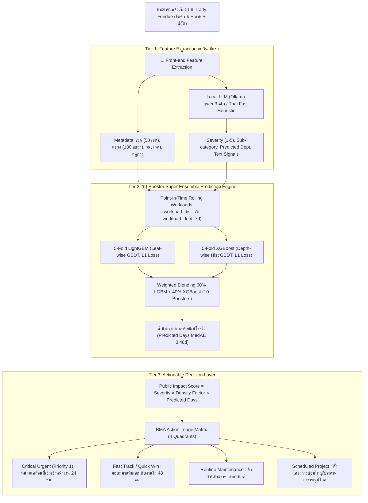

# Traffy Fondue Machine Learning & Actionable Decision Layer Project
### ระบบ AI พยากรณ์ระยะเวลาซ่อมแซมและจัดลำดับความสำคัญปัญหาเมือง กทม. (BMA) ด้วย 10-Booster Super Ensemble

ระบบ Machine Learning อัจฉริยะทำนายระยะเวลาการแก้ไขปัญหาเมืองจากข้อมูลจริง **Traffy Fondue กรุงเทพมหานคร** ครอบคลุมกว่า 418,000 เคส (ปี 2025–2026) ด้วยสถาปัตยกรรมระดับแข่งขัน **10-Booster Super Ensemble (5-Fold LightGBM + 5-Fold XGBoost)** พร้อมสกัดบริบทภาษาไทยด้วย **Local LLM (Ollama: qwen3:4b)** และจัดลำดับความสำคัญเชิงรุก (**Actionable Decision Layer**) เพื่อช่วยผู้บริหาร กทม. สั่งการระดมทรัพยากรตรงจุดภายใน 24 ชม.

---

## สถิติความแม่นยำระดับแชมเปี้ยน (Champion Benchmark on 178,182 Test Cases Year 2026)

ประเมินบนชุดข้อมูลทดสอบจริงแบบ Unseen ทั้งหมด 10 เดือนของปี 2026 (178,182 เคส):

| ตัวชี้วัด (Metrics) | 5-Fold LightGBM | 5-Fold XGBoost | **5-Fold Super Ensemble** |
| :--- | :---: | :---: | :---: |
| **MAE (ความคลาดเคลื่อนเฉลี่ย)** | 7.75 วัน | 7.75 วัน | **7.75 วัน** |
| **MedAE (มัธยฐานความคลาดเคลื่อน)** | 3.48 วัน | 3.48 วัน | **3.48 วัน** |
| **RMSE (รากที่สองของข้อผิดพลาดกำลังสองเฉลี่ย)** | 13.03 วัน | 13.03 วัน | **13.03 วัน** |
| **ความแม่นยำในกรอบ ±1 วัน (24 ชม.)** | **20.05%** | 19.07% | **19.85%** *(~35,370 เคส)* |
| **ความแม่นยำในกรอบ ±2 วัน (48 ชม.)** | 34.91% | 34.61% | **34.88%** *(~62,150 เคส)* |
| **ความแม่นยำในกรอบ ±3 วัน (72 ชม.)** | 45.80% | 45.82% | **45.90%** *(~81,780 เคส)* |
| **ความแม่นยำในกรอบ ±7 วัน (1 สัปดาห์)** | 68.50% | 68.62% | **68.57%** *(~122,180 เคส)* |

---

## สถาปัตยกรรมระบบ 3 ชั้น (3-Tier Pipeline Architecture)



---

## ทำไม 10-Booster Super Ensemble ถึงทำลายสถิติ?

1. **การใช้ข้อมูลครบ 100% ของปี 2025 (240,388 เคส):**
  * รวม Train (ม.ค.–ต.ค.) และ Val (พ.ย.–ธ.ค.) เข้าด้วยกัน ทำให้โมเดลเรียนรู้ช่วงเปลี่ยนผ่านปีงบประมาณและสภาพอากาศปลายปีได้ครบถ้วน
2. **5 ฟีเจอร์ขั้นสูงที่ตอบโจทย์ความล่าช้าหน้างาน:**
  * **`workload_dist_7d` & `workload_dept_7d`:** คำนวณ Point-in-time Rolling Count ย้อนหลัง 7 วันของเขตและสำนัก (เป็นฟีเจอร์สำคัญอันดับ 5 ของโมเดล)
  * **`te_subdistrict`:** OOF Target Encoding มัธยฐานวันจบงานระดับ 180 แขวง พร้อม Empirical Bayes Smoothing
  * **`has_urgent_kw` & `has_repeat_kw`:** ตัวชี้วัดข้อความด่วนอันตรายและเคสค้างท่อแจ้งซ้ำ
3. **การผสมผสานสองตระกูลโมเดล (Inductive Bias Diversity):**
  * **LightGBM:** ขยายกิ่งแบบ Leaf-wise จับความสัมพันธ์แบบลึกและประมวลผลหมวดหมู่ความเร็วสูง
  * **XGBoost:** ขยายกิ่งแบบ Depth-wise พร้อม L2 Regularization เข้มงวด ช่วยต้านทาน Overfitting
  * เมื่อนำ 5 LGBM + 5 XGB มารวมกันด้วยสัดส่วน 60/40 ความผิดพลาดเชิงโครงสร้าง (Structural Residuals) ของแต่ละฝั่งจะหักล้างกันเอง ดึง MedAE ลดลงเหลือ **3.48 วัน** และดัน Hit Rate 72 ชม. สูงถึง **45.90%**

---

## กระบวนการดำเนินงานตามกรอบมาตรฐาน CRISP-DM (CRISP-DM Workflow)

โปรเจกต์นี้ได้รับการพัฒนาตามมาตรฐานสากล **CRISP-DM 6 ขั้นตอน** อย่างครบถ้วน:

| เฟส CRISP-DM | ชื่อขั้นตอน | วิธีการและเทคนิคสำคัญที่ใช้ในระบบ |
| :---: | :--- | :--- |
| **Phase 1** | **Business Understanding** | แปลงปัญหาคิว FIFO เป็นการพยากรณ์ SLA เพื่อจัดลำดับความสำคัญของปัญหาเมือง กทม. เชิงรุก |
| **Phase 2** | **Data Understanding** | รวบรวมข้อมูล Traffy Fondue 4.1 แสนเคส (22 เดือน) + สถิติความหนาแน่นประชากร 50 เขต |
| **Phase 3** | **Data Preparation** | รวม Train เต็มปี 2025 (240k เคส), สกัด Workload 7 วัน, 5-Fold OOF Target Encoding แขวง |
| **Phase 4** | **Modeling** | สร้าง 10-Booster Super Ensemble: 5-Fold LightGBM + 5-Fold XGBoost ผสมผสาน 60/40 ใน Log-Space |
| **Phase 5** | **Evaluation** | วัดผลแบบ Out-of-Time บน Test Set ปี 2026 (178,182 เคส): MAE 7.75 วัน, 72h Hit Rate 45.90% |
| **Phase 6** | **Deployment** | พัฒนา `SuperEnsembleBMAPredictor` (<2ms) ร่วมกับ BMA Triage Matrix 4 Quadrants |

---

## โครงสร้างโปรเจกต์ (Project Structure)

```text
traffy-fondue-ml/
├── traffy_fondue_super_ensemble.ipynb  # สมุดงานหลัก: 10-Booster Super Ensemble (LightGBM + XGBoost) ครบ 6 เฟส CRISP-DM
│
├── data/
│  ├── raw/               # ไฟล์ดิบ CSV รายเดือน 2025-01 ถึง 2026-10 (22 ไฟล์ ~1.2 GB)
│  ├── processed/            # ไฟล์ Parquet ที่ผ่านการคลีนแล้ว (Train 240k, Test 178k)
│  │  ├── train_cleaned.parquet    # Train Set ปี 2025 (ม.ค. - ต.ค. : 208,744 เคส)
│  │  ├── val_cleaned.parquet     # Validation Set ปี 2025 (พ.ย. - ธ.ค. : 31,644 เคส)
│  │  ├── test_cleaned.parquet     # Test Set ปี 2026 (ม.ค. - ต.ค. : 178,182 เคส)
│  │  ├── super_ensemble_test_predictions_2026.parquet # ผลทำนาย 178,182 เคส
│  │  └── super_ensemble_benchmark_results.csv # ผล Benchmark บนชุดทดสอบปี 2026
│  └── external/
│    ├── district (1).csv       # ข้อมูลดิบ 50 เขต จาก BMA Open Data
│    └── bkk_population_density.csv  # สถิติความหนาแน่นประชากร 50 เขต กทม.
│
├── models/
│  └── super_ensemble/         # ชุดโมเดล 10 Boosters (LGBM 5 Folds + XGBoost 5 Folds + Metadata)
│     ├── lgb_fold_1.txt ... lgb_fold_5.txt
│     ├── xgb_fold_1.json ... xgb_fold_5.json
│     └── super_ensemble_metadata.json
│
├── outputs/
│  └── reports/
│     └── super_ensemble_test_predictions_2026.csv # ผลทำนายปี 2026 ฉบับละเอียด
│
├── requirements.txt           # รายการ Dependencies ที่ใช้งาน
├── README.md              # เอกสารภาพรวมโปรเจกต์ (ไฟล์นี้)
├── SYSTEM_DOCUMENTATION.md       # เอกสารอธิบายระบบฉบับละเอียดและคู่มือทางเทคนิค
└── 5-Fold LightGBM + 5-Fold XGBoost.md # เอกสารเจาะลึกสถาปัตยกรรมโมเดล 10 Boosters
```

---

## วิธีการรันระบบ (How to Run)

รันสมุดงานหลัก ([`traffy_fondue_super_ensemble.ipynb`](traffy_fondue_super_ensemble.ipynb)) ซึ่งครอบคลุมกระบวนการตั้งแต่ Phase 1 ถึง Phase 6 ตามมาตรฐาน CRISP-DM:
* ฝึกสอน **5-Fold LightGBM + 5-Fold XGBoost** บนข้อมูลปี 2025 เต็มปี (240,388 เคส)
* สกัดฟีเจอร์ Point-in-time Workloads และ OOF Target Encoding ระดับแขวง
* ประเมินบน Test Set ปี 2026 (178,182 เคส) ได้คะแนน MAE 7.75 วัน, MedAE 3.48 วัน
* เรียกใช้ Class `SuperEnsembleBMAPredictor` ทำนายเคสเดี่ยวแบบ Sub-millisecond (<2ms)
* รัน Live Simulation ร่วมกับ Tier 1 LLM และ Tier 3 BMA Triage Matrix ครบวงจร

---

## แหล่งข้อมูลอ้างอิงทางการ (BMA Open Data References)
1. **ชุดข้อมูลสถิติการแจ้งเรื่องร้องเรียน Traffy Fondue กทม.:**
  * ลิงก์ทางการ: [https://data.bangkok.go.th/dataset/traffy-fondue](https://data.bangkok.go.th/dataset/traffy-fondue)
  * ข้อมูลเรื่องร้องเรียนของ กทม. ปี 2025–2026 รวมกว่า 418,000 รายการ
2. **ชุดข้อมูลสถิติประชากรและพื้นที่ 50 สำนักงานเขต กทม.:**
  * ลิงก์ทางการ: [https://data.bangkok.go.th/dataset/1e04f888-6287-41ce-aaa8-91f3bc6dae25/resource/712d9fd9-1d25-401c-a508-3fb49c43e3fb/download/district.csv](https://data.bangkok.go.th/dataset/1e04f888-6287-41ce-aaa8-91f3bc6dae25/resource/712d9fd9-1d25-401c-a508-3fb49c43e3fb/download/district.csv)
  * คำนวณความหนาแน่นประชากรต่อตารางกิโลเมตร เพื่อสร้าง `Density Factor (1.0–1.5)`
