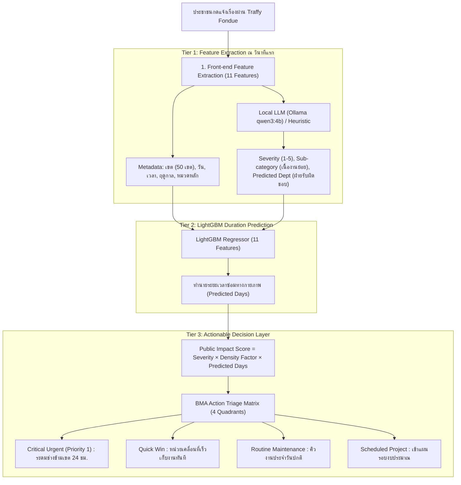

# Traffy Fondue Machine Learning & Actionable Decision Layer Project

ระบบ Machine Learning อัจฉริยะทำนายระยะเวลาการแก้ไขปัญหาเมืองจากข้อมูลจริง **Traffy Fondue (กทม.)** ด้วย **LightGBM (11 Features)** พร้อมสกัดบริบทด้วย **Local LLM (Ollama: qwen3:4b)** และจัดลำดับความสำคัญเชิงรุก (**Actionable Decision Layer**) เพื่อช่วยผู้บริหาร กทม. ตัดสินใจสั่งการและระดมทรัพยากรตรงจุด

---

## ️ สถาปัตยกรรมระบบ 3 ชั้น (3-Tier Pipeline Architecture)



---

##  ตัวแปรต้น 11 Features หน้างาน (ตัวแปร X)

| ลำดับ | Feature Name | ประเภท | ความสำคัญ (Gain %) | หน้าที่และความหมาย |
| :---: | :--- | :---: | :---: | :--- |
| 1 | `district` | Categorical | **32.23%** | 50 สำนักงานเขต กทม. (งบประมาณและกำลังคนแต่ละเขตไม่เท่ากัน) |
| 2 | `predicted_dept` | Categorical | **25.53%** | ฝ่ายรับผิดชอบที่ AI ประเมิน (โยธา, เทศกิจ, รักษาความสะอาด, ระบายน้ำ ฯลฯ) |
| 3 | `sub_category` | Categorical | **17.46%** | เนื้องานย่อย (เช่น ฝาท่อแตก vs ขุดลอกท่อ, ป้ายล้ม vs ปรับปรุงถนน) |
| 4 | `main_type` | Categorical | **10.65%** | ประเภทปัญหาหลัก (ถนน, ทางเท้า, ไฟฟ้า, ความสะอาด, ท่อระบายน้ำ) |
| 5 | `month` | Numerical | 4.71% | เดือนที่แจ้ง (1-12) บอกรอบงบประมาณและสภาพอากาศ |
| 6 | `comment_len` | Numerical | 3.83% | ความยาวข้อความร้องเรียน (ข้อความยาวสะท้อนปัญหาซับซ้อน) |
| 7 | `day_of_week` | Numerical | 3.50% | วันในสัปดาห์ (0 = จันทร์, ..., 6 = อาทิตย์) |
| 8 | `hour` | Numerical | 1.14% | เวลาที่แจ้งเรื่อง (0 - 23 น.) แจ้งในเวลาราชการเริ่มงานได้ทันที |
| 9 | `is_rainy_season` | Binary | 0.62% | หน้าฝน (พ.ค. - ต.ค.) กระทบการทำงานกลางแจ้งและการซ่อมถนน |
| 10 | `severity` | Numerical | 0.29% | ระดับความรุนแรง (1 - 5) ประเมินจากข้อความร้องเรียน |
| 11 | `is_weekend` | Binary | 0.04% | เสาร์-อาทิตย์ (0 หรือ 1) มีเฉพาะเวรฉุกเฉิน |

---

##  ผลการประเมินโมเดลกับข้อมูลจริง (Test Set 2024 กลางปี)

ฝึกสอนด้วยข้อมูลจริงของ กทม. 177,726 แถว (ปี 2023) และทดสอบบน Holdout Test Set ปี 2024:

* **MAE (ความคลาดเคลื่อนเฉลี่ย):** `7.04 วัน`
* **Median AE (มัธยฐานความคลาดเคลื่อน):** `2.97 วัน` (< 3 วัน)
* **ความแม่นยำในกรอบ ±1 วัน (24 ชม.):** `17.44%`
* **ความแม่นยำในกรอบ ±2 วัน (48 ชม.):** `36.23%`
* **ความแม่นยำในกรอบ ±3 วัน:** `50.42%`

---

## โครงสร้างโปรเจกต์ (Project Structure)

```text
traffy-fondue-ml/
├── traffy_fondue_pipeline.ipynb         # สมุดงานหลัก All-in-One ครอบคลุม CRISP-DM Phase 1 ถึง Phase 6
│
├── data/
│   ├── raw/                             # ไฟล์ CSV ข้อมูลจริงรายเดือน 2023-01 ถึง 2024-06 (745 MB)
│   ├── processed/                       # ไฟล์ Parquet & CSV ที่ผ่านการคลีนแล้ว (Train, Val, Test)
│   └── external/
│       ├── district.csv                 # ข้อมูลดิบ 50 เขต จาก BMA Open Data
│       └── bkk_population_density.csv   # สถิติความหนาแน่นประชากร 50 เขต กทม. (คำนวณจาก BMA Open Data)
│
├── models/
│   ├── lightgbm_traffy_real.txt         # ไฟล์โมเดลเดี่ยว LightGBM
│   ├── categories.json                  # การจัดหมวดหมู่ Categorical 4 มิติ
│   └── specialized/                     # โมเดลเฉพาะทางประจำฝ่าย (MoE Architecture)
│       ├── model_yotha.txt & categories_yotha.json
│       ├── model_cleanliness.txt & categories_cleanliness.json
│       ├── model_thetsakit.txt & categories_thetsakit.json
│       ├── model_environment.txt & categories_environment.json
│       ├── model_drainage.txt & categories_drainage.json
│       └── model_general.txt & categories_general.json
│
├── outputs/
│   └── reports/
│       ├── specialized_vs_single_comparison.csv # ตารางเปรียบเทียบผลลัพธ์
│       ├── real_triage_evaluation.csv           # ผลการจัดคิว Triage 5,000 เคสจริง
│       └── demo_triage_results.csv              # ผลการรันเดโม
│
├── scripts/                             # โฟลเดอร์เก็บไฟล์ Python scripts ทั้งหมด (Local only ไม่ขึ้น Git)
├── requirements.txt                     # รายการ Dependencies ที่ใช้งาน
├── README.md                            # คู่มือภาพรวมโปรเจกต์
└── SYSTEM_DOCUMENTATION.md              # เอกสารอธิบายระบบฉบับละเอียด
```

---

## วิธีการรันระบบ (How to Run)

เปิดและรันสมุดงาน [`traffy_fondue_pipeline.ipynb`](file:///C:/Users/thewh/Downloads/traffy-fondue-ml/traffy_fondue_pipeline.ipynb)
ครอบคลุมกระบวนการทั้งหมดตั้งแต่ต้นจนจบตามมาตรฐาน CRISP-DM Phase 1 ถึง Phase 6:
1. **Phase 1: Business Understanding:** ทำความเข้าใจบริบทปัญหา กทม. และกำหนดเป้าหมาย
2. **Phase 2 & 3: Data Understanding & Preparation:** คลีนข้อมูลจริง 3 ชุด (Train, Val, Test) และสถิติประชากร
3. **Phase 4: Modeling:** ฝึกสอนโมเดล Baseline LightGBM และชุดโมเดลเฉพาะทาง (Specialized Sub-models)
4. **Phase 5: Evaluation:** ประเมินผลแบบ Head-to-Head บน Holdout Test Set (49,010 เคส)
5. **Phase 6: Deployment:** คำนวณ Public Impact Score, จัดคิว Action Matrix (4 Quadrants) และจำลองรันเคสจริง

---

## แหล่งข้อมูลอ้างอิงภายนอก (External Data Reference)
1. **ชุดข้อมูลสถิติการแจ้งเรื่องร้องเรียน Traffy Fondue (BMA Open Data):**
   * ลิงก์ตรง: [https://data.bangkok.go.th/dataset/traffy-fondue](https://data.bangkok.go.th/dataset/traffy-fondue)
   * ข้อมูลเรื่องร้องเรียนของกรุงเทพมหานคร ครอบคลุม 18 เดือน (ปี 2023 - มิ.ย. 2024 รวม 275,621 รายการ)
2. **ชุดข้อมูลสถิติประชากรและพื้นที่ 50 สำนักงานเขต (BMA Open Data):**
   * ลิงก์ตรง: [https://data.bangkok.go.th/dataset/1e04f888-6287-41ce-aaa8-91f3bc6dae25/resource/712d9fd9-1d25-401c-a508-3fb49c43e3fb/download/district.csv](https://data.bangkok.go.th/dataset/1e04f888-6287-41ce-aaa8-91f3bc6dae25/resource/712d9fd9-1d25-401c-a508-3fb49c43e3fb/download/district.csv)
   * นำมาคำนวณ: ประชากรรวม = num_male + num_female, ขนาดพื้นที่ = area_dis (ตร.กม.), ความหนาแน่นประชากร = ประชากรรวม / ขนาดพื้นที่
