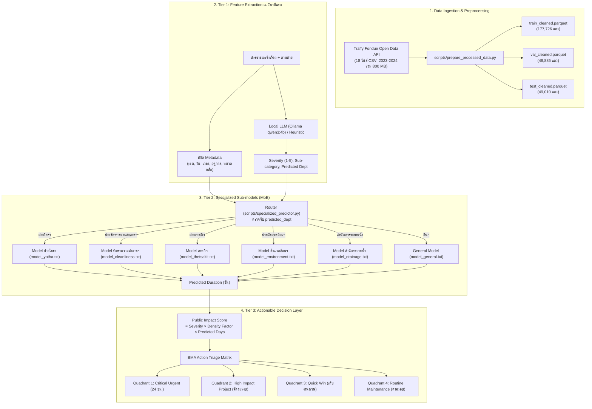

# เอกสารอธิบายระบบและกระบวนการทำงานฉบับสมบูรณ์ (Traffy Fondue ML System Documentation)

เอกสารฉบับนี้อธิบายรายละเอียดเชิงลึกของโปรเจกต์พัฒนาระบบ Machine Learning และ Actionable Decision Layer เพื่อคาดการณ์ระยะเวลาซ่อมแซมและจัดลำดับความสำคัญของปัญหาเมืองจากข้อมูลจริง **Traffy Fondue กทม.**

---

## สารบัญ
1. [เป้าหมายและโจทย์ของโปรเจกต์](#1-เป้าหมายและโจทย์ของโปรเจกต์)
2. [การเทียบเคียงตามมาตรฐาน CRISP-DM (CRISP-DM Framework Mapping)](#2-การเทียบเคียงตามมาตรฐาน-crisp-dm-crisp-dm-framework-mapping)
3. [ภาพรวมสถาปัตยกรรมระบบ (End-to-End Architecture)](#3-ภาพรวมสถาปัตยกรรมระบบ-end-to-end-architecture)
4. [เทคโนโลยีและเครื่องมือที่ใช้ (Tech Stack & Tools)](#4-เทคโนโลยีและเครื่องมือที่ใช้-tech-stack--tools)
5. [ข้อมูลที่ใช้และการจัดเก็บ (Data Pipeline & Storage)](#5-ข้อมูลที่ใช้และการจัดเก็บ-data-pipeline--storage)
6. [การคลีนข้อมูลและการสร้างตัวแปร (Data Preprocessing & Feature Engineering)](#6-การคลีนข้อมูลและการสร้างตัวแปร-data-preprocessing--feature-engineering)
7. [การพัฒนาโมเดล Machine Learning (LightGBM & Specialized Sub-models)](#7-การพัฒนาโมเดล-machine-learning-lightgbm--specialized-sub-models)
8. [ชั้นการตัดสินใจเชิงรุก (Actionable Decision Layer & Triage Matrix)](#8-ชั้นการตัดสินใจเชิงรุก-actionable-decision-layer--triage-matrix)
9. [ผลการทดสอบและการวัดประสิทธิภาพ (Evaluation & Benchmark Results)](#9-ผลการทดสอบและการวัดประสิทธิภาพ-evaluation--benchmark-results)
10. [โครงสร้างไฟล์และวิธีรันระบบ (Project Structure & How-To-Run)](#10-โครงสร้างไฟล์และวิธีรันระบบ-project-structure--how-to-run)

---

## 2. การเทียบเคียงตามมาตรฐาน CRISP-DM (CRISP-DM Framework Mapping)

| ขั้นตอน CRISP-DM | กิจกรรมหลักในโปรเจกต์ Traffy Fondue ML | ตำแหน่งในสมุดงาน ([`traffy_fondue_pipeline.ipynb`](file:///C:/Users/thewh/Downloads/traffy-fondue-ml/traffy_fondue_pipeline.ipynb)) |
| :--- | :--- | :--- |
| **Phase 1: Business Understanding** | วิเคราะห์ปัญหาคิวงาน FIFO ของ กทม. และกำหนดเป้าหมายพยากรณ์วันซ่อมเสร็จล่วงหน้า ณ วินาทีแรก พร้อมจัดคิว Triage สั่งการด่วน 24 ชม. | Cell 0 (CRISP-DM Phase 1) |
| **Phase 2: Data Understanding** | สำรวจชุดข้อมูลดิบ 18 เดือน (745 MB) และข้อมูลประชากร/พื้นที่ 50 เขต (BMA Open Data) สำรวจความสัมพันธ์ของ 11 Features หน้างาน และ Target `duration_days` | Cell 2 & Cell 4 (CRISP-DM Phase 2) |
| **Phase 3: Data Preparation** | คลีนข้อมูล Traffy Fondue 3 ชุด (Train 2023, Val 2024 Q1, Test 2024 Q2), ตัด Outliers, คลีนชื่อเขต, สกัดฟีเจอร์ และคำนวณ `pop_density` จาก `district (1).csv` | Cell 3 & Cell 18 (CRISP-DM Phase 3) |
| **Phase 4: Modeling** | พัฒนา Baseline LightGBM, ฝึกสอน Specialized Sub-models (MoE) 5 ฝ่าย, พัฒนา Tier 1 LLM Severity Analyzer และ Tier 2 MoE Router | Cell 6, 8, 11, 13 (CRISP-DM Phase 4) |
| **Phase 5: Evaluation** | วัดผลเปรียบเทียบ Head-to-Head บน Test Set (49,010 เคส), คำนวณ MAE, Median AE, R2, Accuracy ±1/±2/±3 วัน, วิเคราะห์ Feature Importance (Gain & Split) | Cell 15 (CRISP-DM Phase 5) |
| **Phase 6: Deployment** | พัฒนา Tier 3 Actionable Decision Layer, คำนวณ Public Impact Score, จัดกลุ่ม Action Triage Matrix 4 Quadrants และทดสอบรัน End-to-End Simulation สด | Cell 17, 20 (CRISP-DM Phase 6) |

---

## 1. เป้าหมายและโจทย์ของโปรเจกต์

ระบบ Traffy Fondue ของกรุงเทพมหานครมีประชาชนแจ้งเรื่องร้องเรียนเข้ามามากกว่า **200,000 – 300,000 เรื่องต่อปี** ปัญหาหลักที่ กทม. กำลังเผชิญคือ:
1. **ไม่สามารถคาดการณ์วันแล้วเสร็จได้ล่วงหน้า:** ประชาชนไม่รู้ว่าจะต้องรอกี่วัน เจ้าหน้าที่ไม่สามารถวางแผนทรัพยากรล่วงหน้าได้
2. **คิวงานแบบมาก่อน-ได้ก่อน (FIFO):** ปัญหาวิกฤต (เช่น ฝาท่อชำรุดลึก, เสาไฟเอียง) ถูกวางไว้ในคิวเดียวกับปัญหาความสวยงาม (เช่น ตัดหญ้า, ทาสี)
3. **ลักษณะงานของแต่ละฝ่ายมีความแตกต่างกันสูงมาก:** ฝ่ายรักษาความสะอาดฯ จบงานได้ใน 1-2 วัน ขณะที่ฝ่ายโยธาต้องรอแบบก่อสร้างหรือจัดซื้อจัดจ้างยาวนานกว่า 10-30 วัน

**วัตถุประสงค์ของโปรเจกต์:**
* สร้างโมเดล Machine Learning (**LightGBM**) ที่ใช้เพียง **11 ตัวแปรหน้างานที่รู้ ณ วินาทีแรกที่แจ้ง** เพื่อทำนายระยะเวลาซ่อมแซมเสร็จจริง (`duration_days`)
* นำ **Local LLM (Ollama)** มาสกัดความรุนแรง (Severity) และฝ่ายรับผิดชอบจากข้อความร้องเรียน
* พัฒนาสถาปัตยกรรม **Specialized Sub-models (Mixture of Experts)** แยกโมเดลประจำฝ่ายงานเพื่อเพิ่มความแม่นยำ
* สร้าง **Actionable Decision Layer** จัดกลุ่มเคสออกเป็น 4 Quadrants ให้ผู้บริหาร กทม. สั่งการได้ทันที

---

## 2. ภาพรวมสถาปัตยกรรมระบบ (End-to-End Architecture)



---

## 3. เทคโนโลยีและเครื่องมือที่ใช้ (Tech Stack & Tools)

| เครื่องมือ / เทคโนโลยี | หมวดหมู่ | หน้าที่และความรับผิดชอบในระบบ | เหตุผลที่เลือกใช้ |
| :--- | :--- | :--- | :--- |
| **Python 3.11** | ภาษาหลัก | Core Backend, Data Pipeline, Training | Ecosystem ด้าน Data Science สมบูรณ์ที่สุด |
| **LightGBM** | Machine Learning | Gradient Boosting Decision Tree สำหรับทำนายจำนวนวัน | ประสิทธิภาพสูงมาก, รองรับ Categorical Features แบบ Native, เทรนข้อมูลระดับแสนแถวได้ใน 5-10 วินาที |
| **Ollama (qwen3:4b)** | Local LLM | สกัดความรุนแรง (Severity 1-5), งานย่อย และฝ่ายรับผิดชอบ | รันแบบ Local ออฟไลน์ได้ ไม่เสียค่า API, ไม่เสี่ยงข้อมูลประชาชนรั่วไหล |
| **Apache Arrow / Parquet** | Data Storage | บันทึกชุดข้อมูล Cleaned Data ใน `data/processed/` | โหลดข้อมูล 170k แถวได้ใน <0.5 วินาที, บีบอัดขนาดไฟล์ลง 70-80% เมื่อเทียบกับ CSV |
| **Pandas & NumPy** | Data Manipulation | Data Cleaning, Vectorized Transformation, Aggregation | ดำเนินการคัดกรองและประมวลผลข้อมูลแบบความเร็วสูง |
| **Scikit-learn** | Model Evaluation | คำนวณค่า MAE, Median AE, R-Squared | มาตรฐานสากลในการวัดผลประเมินโมเดล Regression |
| **Git & GitHub** | Version Control | จัดการซอร์สโค้ดและแยก Branch (`feature/specialized-submodels`) | ควบคุมเวอร์ชันและติดตามผลการทดลอง |

---

## 4. ข้อมูลที่ใช้และการจัดเก็บ (Data Pipeline & Storage)

### 4.1 แหล่งที่มาของข้อมูล
* **ชุดข้อมูลเปิด Traffy Fondue กรุงเทพมหานคร (BMA Open Data):** [https://data.bangkok.go.th/dataset/traffy-fondue](https://data.bangkok.go.th/dataset/traffy-fondue)
* ข้อมูลดิบดาวน์โหลดผ่าน API ทางการของ Traffy Fondue กทม. (`publicapi.traffy.in.th`) และศูนย์ข้อมูลเปิดกรุงเทพมหานคร
* ครอบคลุมระยะเวลา 18 เดือน:
  * **ปี 2023 (ม.ค. - ธ.ค. รวม 12 ไฟล์):** สำหรับฝึกสอน (Train Set) รวม 177,726 เคส
  * **ปี 2024 ครึ่งปีแรก (ม.ค. - มิ.ย. รวม 6 ไฟล์):**
    * เดือน 1-3 (ต้นปี): สำหรับตรวจสอบ (Validation Set) 48,885 เคส
    * เดือน 4-6 (กลางปี): สำหรับทดสอบจริง (Test Set) 49,010 เคส

### 4.2 ข้อมูลเสริมภายนอก (External Data)
* **ชุดข้อมูล:** ข้อมูลขอบเขตสำนักงานเขตและสถิติประชากรรายเขต กรุงเทพมหานคร 50 เขต
* **แหล่งอ้างอิงทางการ (BMA Open Data):** [https://data.bangkok.go.th/dataset/1e04f888-6287-41ce-aaa8-91f3bc6dae25/resource/712d9fd9-1d25-401c-a508-3fb49c43e3fb/download/district.csv](https://data.bangkok.go.th/dataset/1e04f888-6287-41ce-aaa8-91f3bc6dae25/resource/712d9fd9-1d25-401c-a508-3fb49c43e3fb/download/district.csv)
* **ไฟล์ข้อมูลดิบ:** `district (1).csv` (จากศูนย์ข้อมูลเปิดกรุงเทพมหานคร)
* **ไฟล์ที่ผ่านการคลีนและคำนวณ:** [`data/external/bkk_population_density.csv`](file:///C:/Users/thewh/Downloads/traffy-fondue-ml/data/external/bkk_population_density.csv)
  - ประชากรรวม: `population = num_male + num_female`
  - ขนาดพื้นที่: `area_sqkm = area_dis` (ตารางกิโลเมตร)
  - ความหนาแน่นประชากร: `pop_density = population / area_sqkm` (คน/ตร.กม.)
  - นำมาคำนวณเป็น `Density Factor` (1.0 ถึง 1.5) ใน Tier 3 Actionable Decision Layer เพื่อสะท้อนผลกระทบต่อประชาชนในพื้นที่หนาแน่นสูง

### 4.3 โครงสร้าง Two-Stage Decoupled Pipeline
ระบบเปลี่ยนจากการคลีนสดใน RAM มาเป็นสถาปัตยกรรม 2 ขั้นตอนตาม Best Practice:
1. **Stage 1 (Data Prep):** รัน [`scripts/prepare_processed_data.py`](file:///C:/Users/thewh/Downloads/traffy-fondue-ml/scripts/prepare_processed_data.py) เพียงครั้งเดียว บันทึกไฟล์ลงใน [`data/processed/`](file:///C:/Users/thewh/Downloads/traffy-fondue-ml/data/processed/):
   * `train_cleaned.parquet` (46.56 MB) & `train_cleaned.csv` (188.12 MB)
   * `val_cleaned.parquet` (12.97 MB) & `val_cleaned.csv` (52.09 MB)
   * `test_cleaned.parquet` (12.86 MB) & `test_cleaned.csv` (49.69 MB)
2. **Stage 2 (Model Training):** สคริปต์เทรนโหลดตรงจาก `.parquet` ทำให้โหลดข้อมูลเสร็จใน **0.5 วินาที** (จากเดิม 40 วินาที)

---

## 5. การคลีนข้อมูลและการสร้างตัวแปร (Data Preprocessing & Feature Engineering)

### 5.1 กฎการกรองข้อมูลดิบ (Cleaning Logic)
1. **คัดกรองเฉพาะเคสที่สำเร็จ:** กรองคอลัมน์ `state` ให้เหลือเฉพาะเคสที่มีคำว่า "เสร็จสิ้น" หรือ "finish"
2. **คำนวณ Target (`duration_days`):** แปลงเวลาจาก `duration_minutes_total / 1440.0`
3. **ตัด Outliers ที่ผิดปกติในโลกความจริง:**
   * ตัดเคสที่เสร็จต่ำกว่า **0.04 วัน (~1 ชั่วโมง):** มักเป็นการกดปิดงานผิดพลาด หรือรับเรื่องซ้ำ
   * ตัดเคสที่ใช้เวลาเกิน **60 วัน:** งานข้ามปีงบประมาณหรืองานดองระบบ

### 5.2 การสกัด 11 ตัวแปรหน้างาน (The 11 Front-End Features)

| ลำดับ | ชื่อตัวแปร (Feature) | ประเภท Data | ความสำคัญ (Gain %) | คำอธิบายและเทคนิคที่ใช้ |
| :---: | :--- | :---: | :---: | :--- |
| 1 | `district` | Categorical | **32.23%** | ชื่อเขต 50 เขต กทม. (สะท้อนงบประมาณ กำลังคน และสภาพพื้นที่) |
| 2 | `predicted_dept` | Categorical | **25.53%** | ฝ่ายรับผิดชอบหลัก สกัดจาก Rule-based / LLM (โยธา, เทศกิจ, รักษาความสะอาด ฯลฯ) |
| 3 | `sub_category` | Categorical | **17.46%** | เนื้องานย่อย เช่น แยก "ฝาท่อแตก" ออกจาก "ลอกท่อระบายน้ำ" |
| 4 | `main_type` | Categorical | **10.65%** | ประเภทปัญหาหลัก (ถนน, ทางเท้า, ขยะ, ท่อระบายน้ำ, ไฟฟ้า) |
| 5 | `month` | Numerical | 4.71% | เดือนที่แจ้ง (1-12) สะท้อนรอบการเบิกจ่ายงบประมาณ กทม. |
| 6 | `comment_len` | Numerical | 3.83% | ความยาวตัวอักษรของข้อความ (ข้อความยาวยิ่งบ่งบอกปัญหาซับซ้อน) |
| 7 | `day_of_week` | Numerical | 3.50% | วันในสัปดาห์ (0=จันทร์, 6=อาทิตย์) |
| 8 | `hour` | Numerical | 1.14% | เวลาที่แจ้งเรื่อง (0-23 น.) แจ้งในเวลาราชการเริ่มงานได้ทันที |
| 9 | `is_rainy_season` | Binary | 0.62% | ฤดูฝน (พ.ค. - ต.ค.) กระทบต่องานซ่อมทางและกลางแจ้งอย่างมาก |
| 10 | `severity` | Numerical | 0.29% | ระดับความรุนแรง (1=เล็กน้อย ถึง 5=อันตรายถึงชีวิต) |
| 11 | `is_weekend` | Binary | 0.04% | วันเสาร์-อาทิตย์ (เจ้าหน้าที่ประจำส่วนใหญ่หยุดงาน มีเฉพาะเวรฉุกเฉิน) |

---

## 6. การพัฒนาโมเดล Machine Learning (LightGBM & Specialized Sub-models)

### 6.1 กลยุทธ์การฝึกสอน LightGBM
* **Objective Function:** `regression_l1` (L1 Loss / Mean Absolute Error) เพื่อให้โมเดลทำนายค่ามัธยฐานและไม่ถูกดึงด้วยเคสที่แก้นานผิดปกติ
* **Target Transformation:** ฝึกสอนบน $\log(1 + \text{duration\_days})$ แล้วแปลงกลับด้วย $\exp(x) - 1$ เพื่อลดความเบ้ (Skewness) ของระยะเวลา
* **Native Categorical Handling:** กำหนด `categorical_feature=['district', 'main_type', 'sub_category']` ให้ LightGBM แตกกิ่งโดยตรง ไม่ต้องทำ One-Hot Encoding

### 6.2 สถาปัตยกรรม Specialized Sub-models (Mixture of Experts)
แทนที่จะใช้โมเดลเดี่ยวรวมทุกฝ่าย เราได้ออกแบบและเทรนโมเดลแยกอิสระตามความเชี่ยวชาญของแต่ละหน่วยงาน:
1. **`model_yotha.txt` (ฝ่ายโยธา):** ใช้ `num_leaves=63` จัดการงานโครงสร้างพื้นฐานที่มีความซับซ้อนสูง
2. **`model_cleanliness.txt` (ฝ่ายรักษาความสะอาดฯ):** จัดการงานเก็บขยะ ตัดกิ่งไม้ กวาดล้างถนน
3. **`model_thetsakit.txt` (ฝ่ายเทศกิจ):** จัดการหาบเร่แผงลอย ป้ายผิดกฎหมาย กีดขวางทางเท้า
4. **`model_environment.txt` (ฝ่ายสิ่งแวดล้อมฯ):** จัดการเรื่องกลิ่น เสียง มลพิษ สุขาภิบาล
5. **`model_drainage.txt` (สำนักการระบายน้ำ):** จัดการปัญหาน้ำท่วมขัง ลอกท่อ และคลอง
6. **`model_general.txt` (General Fallback):** รองรับเคสของหน่วยงานอื่นๆ นอกเหนือจาก 5 ฝ่ายหลัก

**ตัวขับเคลื่อนระบบ ([`src/specialized_predictor.py`](file:///C:/Users/thewh/Downloads/traffy-fondue-ml/src/specialized_predictor.py)):**
* มีคลาส `SpecializedBMAPredictor`
* รองรับ `predict_single(feature_dict, dept)` สำหรับ API Real-time (<2ms)
* รองรับ `predict_df(df)` แบบ Vectorized Grouped Routing ทำนายข้อมูล 50,000 แถวได้ใน 0.1 วินาที

---

## 7. ชั้นการตัดสินใจเชิงรุก (Actionable Decision Layer & Triage Matrix)

โมเดลทำนายระยะเวลาทางกายภาพ แต่ผู้บริหาร กทม. จำเป็นต้องรู้ว่า **"ควรลงมือทำเคสไหนก่อน"** จึงมี Tier 3 สำหรับแปลงค่าทำนายเป็น Action ทันที:

### 7.1 สูตรคำนวณ Public Impact Score
$$\text{Public Impact Score} = \text{Severity (1–5)} \times \text{Density Factor (1.0–1.5)} \times \text{Predicted Days}$$
* **Severity (1-5):** อันตรายและความเร่งด่วนของปัญหา
* **Density Factor (1.0-1.5):** ความหนาแน่นของประชากรในเขตนั้น (เขตประชากรหนาแน่นสูง เช่น ป้อมปราบ, ดินแดง ปัญหาจะกระทบคนจำนวนมากกว่า)
* **Predicted Days:** หากเป็นปัญหาอันตรายและคาดว่าจะใช้เวลานาน ยิ่งต้องส่งสัญญาณเตือนด่วน

### 7.2 BMA Action Triage Matrix (4 Quadrants)

| Quadrant | เงื่อนไขของปัญหา | คำนิยาม | การสั่งการของผู้บริหาร กทม. (Action) |
| :---: | :---: | :---: | :--- |
| **Q1: Critical Urgent** | ความรุนแรงสูง (≥3) + ซ่อมได้ไว (≤5 วัน) | **วิกฤตเร่งด่วน** | สั่งหน่วยเคลื่อนที่เร็วเข้าเคลียร์หน้างานภายใน 24 ชม. ทันที |
| **Q2: High Impact Project** | ความรุนแรงสูง (≥3) + ซ่อมช้า (>5 วัน) | **โครงการสำคัญผลกระทบสูง** | ตั้งงบด่วนหรือระดมช่างข้ามเขตเพื่อลดระยะเวลาซ่อม |
| **Q3: Quick Win** | ความรุนแรงต่ำ (<3) + ซ่อมไว (≤5 วัน) | **เก็บงานง่ายได้ใจประชาชน** | ให้ทีมเขตเก็บงานทันทีเพื่อเพิ่มคะแนนความพึงพอใจ |
| **Q4: Routine Maintenance** | ความรุนแรงต่ำ (<3) + ซ่อมช้า (>5 วัน) | **งานประจำตามรอบ** | เข้าคิวงานซ่อมบำรุงตามรอบงบประมาณปกติ |

---

## 8. ผลการทดสอบและการวัดประสิทธิภาพ (Evaluation & Benchmark Results)

### 8.1 การทดสอบเปรียบเทียบ Single Model vs Specialized Sub-models (Test Set 49,010 เคส)

| ฝ่ายที่รับผิดชอบ | จำนวนเคสทดสอบ | Single MAE | Specialized MAE | Single MedAE | Specialized MedAE | ผลการพัฒนา (Improvement) |
| :--- | :---: | :---: | :---: | :---: | :---: | :---: |
| **ฝ่ายเทศกิจ** | 13,713 | 4.66 วัน | **4.63 วัน** | 1.93 วัน | **1.81 วัน** |  **แม่นยำขึ้นชัดเจน (Median ผิดพลาดเพียง 1.8 วัน)** |
| **ฝ่ายรักษาความสะอาดฯ** | 6,830 | 4.63 วัน | **4.61 วัน** | 1.98 วัน | **1.94 วัน** |  **ดีขึ้นทั้ง MAE และ MedAE** |
| **ฝ่ายสิ่งแวดล้อมฯ** | 4,154 | 7.86 วัน | **7.78 วัน** | 4.56 วัน | **4.38 วัน** |  **คลาดเคลื่อนลดลง ~1%** |
| **สำนักการระบายน้ำ** | 495 | 6.18 วัน | **6.08 วัน** | 2.60 วัน | **2.59 วัน** |  **MAE ดีขึ้น +1.58%** |
| **ฝ่ายโยธา** | 11,661 | 10.28 วัน | 10.30 วัน | 5.42 วัน | 5.71 วัน |  ใกล้เคียงเดิม (งานโยธามี Outlier เรื่องจัดซื้อจัดจ้าง) |

### 8.2 การทดสอบจริงรายเคส ([`test_specialized_system.py`](file:///C:/Users/thewh/Downloads/traffy-fondue-ml/test_specialized_system.py))
ผลการดึงเคสจริงจาก `test_cleaned.parquet` มาทดสอบ:
* **เขตสาทร (ขยะและสิ่งปฏิกูล):** AI ทำนาย 4.91 วัน | วันเสร็จจริง 4.30 วัน | **คลาดเคลื่อนเพียง 0.61 วัน**
* **เขตบางแค (บาทวิถี/กีดขวาง):** AI ทำนาย 1.59 วัน | วันเสร็จจริง 0.83 วัน | **คลาดเคลื่อนเพียง 0.76 วัน**
* **เขตบางรัก (ขยะตกค้าง):** AI ทำนาย 1.59 วัน | วันเสร็จจริง 3.79 วัน | **คลาดเคลื่อน 2.20 วัน**

---

## 9. โครงสร้างไฟล์และวิธีรันระบบ (Project Structure & How-To-Run)

### 9.1 โครงสร้างไฟล์ในโปรเจกต์
```text
traffy-fondue-ml/
├── data/
│   ├── raw/                 # ไฟล์ CSV ข้อมูลจริง 18 เดือน (2023-01 ถึง 2024-06)
│   ├── processed/           # ชุดข้อมูล Cleaned Parquet & CSV (train, val, test)
│   └── external/
│       └── bkk_population_density.csv   # สถิติความหนาแน่นประชากร 50 เขต
│
├── models/
│   ├── categories.json                  # Categories mappings โมเดลเดี่ยว
│   ├── lightgbm_traffy_real.txt         # Single LightGBM model
│   └── specialized/                     # โมเดลเฉพาะทาง 6 โมเดล
│       ├── model_yotha.txt & categories_yotha.json
│       ├── model_cleanliness.txt & categories_cleanliness.json
│       ├── model_thetsakit.txt & categories_thetsakit.json
│       ├── model_environment.txt & categories_environment.json
│       ├── model_drainage.txt & categories_drainage.json
│       ├── model_general.txt & categories_general.json
│       └── dept_map.json
│
├── outputs/reports/
│   ├── specialized_vs_single_comparison.csv # ตารางเปรียบเทียบผลลัพธ์
│   ├── real_triage_evaluation.csv
│   └── demo_triage_results.csv
│
├── scripts/                             # โฟลเดอร์เก็บไฟล์ Python scripts ทั้งหมด (ไม่ถูกติดตามบน Git)
│   ├── data_preprocessing.py            # ฟังก์ชัน Clean Data & Feature Extraction
│   ├── specialized_predictor.py         # คลาส SpecializedBMAPredictor (MoE Router)
│   ├── llm_severity.py                  # โมดูล Ollama LLM สำหรับสกัด Severity
│   ├── decision_layer.py                # Public Impact Score & 4 Quadrants Matrix
│   ├── prepare_processed_data.py        # สคริปต์ Clean และบันทึกข้อมูลลง data/processed/
│   ├── train_specialized_models.py      # สคริปต์ฝึกสอน Specialized Sub-models
│   ├── train_on_real_data.py            # สคริปต์ฝึกสอนโมเดลเดี่ยว Single Model
│   ├── test_specialized_system.py       # สคริปต์ทดสอบระบบทำนายจริง
│   ├── run_demo.py                      # รันระบบจำลอง End-to-End
│   └── download_data.py                 # สคริปต์ดาวน์โหลดข้อมูลจาก API
│
├── requirements.txt                     # รายการ Libraries ที่ใช้งาน
├── README.md                            # คู่มือเบื้องต้น
├── SYSTEM_DOCUMENTATION.md              # เอกสารอธิบายระบบฉบับละเอียด (ไฟล์นี้)
└── traffy_fondue_pipeline.ipynb         # สมุดงาน Jupyter Notebook ฉบับสมบูรณ์ (CRISP-DM Phase 1-6)
```

### 9.2 ขั้นตอนการรันใช้งาน (Execution Commands)

1. **เตรียมสภาพแวดล้อมและติดตั้งไลบรารี:**
   ```bash
   pip install -r requirements.txt
   ```

2. **คลีนและสร้างไฟล์ชุดข้อมูล (Stage 1 Data Preparation):**
   ```bash
   python scripts/prepare_processed_data.py
   ```

3. **ฝึกสอนและประเมินผลชุดโมเดลเฉพาะทาง (Specialized Sub-models):**
   ```bash
   python scripts/train_specialized_models.py
   ```

4. **ทดสอบระบบทำนายจริงแบบ End-to-End:**
   ```bash
   python scripts/test_specialized_system.py
   ```
