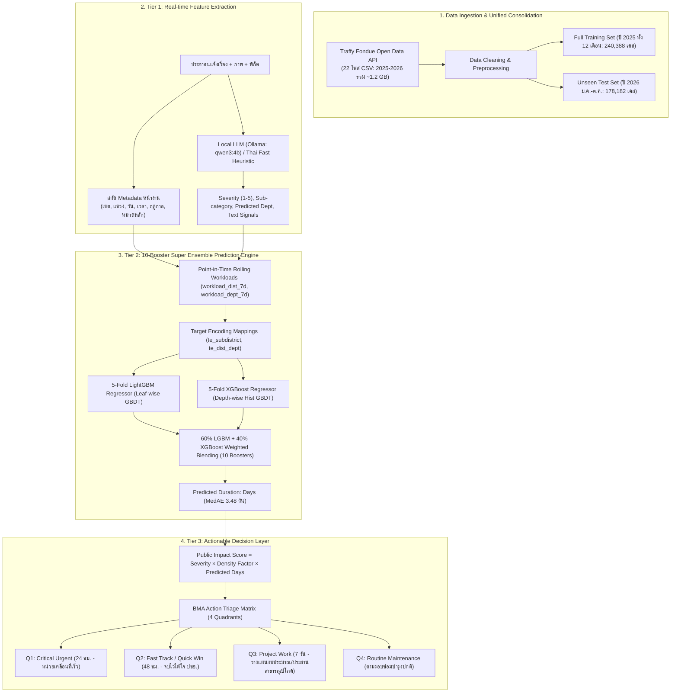

# เอกสารอธิบายระบบและกระบวนการทำงานฉบับสมบูรณ์ (Traffy Fondue ML System Documentation)

เอกสารฉบับนี้อธิบายรายละเอียดเชิงลึกของโปรเจกต์พัฒนาระบบ Machine Learning และ Actionable Decision Layer เพื่อคาดการณ์ระยะเวลาซ่อมแซมและจัดลำดับความสำคัญของปัญหาเมืองจากข้อมูลจริง **Traffy Fondue กทม.** ตามกรอบมาตรฐาน **CRISP-DM** โดยพัฒนาและรันผ่านสมุดงานหลัก:
* [**`traffy_fondue_super_ensemble.ipynb`**](traffy_fondue_super_ensemble.ipynb) : **สมุดงานหลักระดับแชมเปี้ยน (Champion Model)** ครอบคลุมครบวงจร 6 เฟส ใช้สถาปัตยกรรม **10-Booster Super Ensemble (5-Fold LightGBM + 5-Fold XGBoost)**

---

## สารบัญ
1. [เป้าหมายและโจทย์ของโปรเจกต์ (Business Understanding)](#1-เป้าหมายและโจทย์ของโปรเจกต์-business-understanding)
2. [การดำเนินงานเชิงลึกตามมาตรฐาน CRISP-DM (CRISP-DM Deep-Dive Methodology & Techniques)](#2-การดำเนินงานเชิงลึกตามมาตรฐาน-crisp-dm-crisp-dm-deep-dive-methodology--techniques)
3. [ภาพรวมสถาปัตยกรรมระบบ 3 ชั้น (End-to-End Architecture)](#3-ภาพรวมสถาปัตยกรรมระบบ-3-ชั้น-end-to-end-architecture)
4. [เทคโนโลยีและเครื่องมือที่ใช้ (Tech Stack & Tools)](#4-เทคโนโลยีและเครื่องมือที่ใช้-tech-stack--tools)
5. [ข้อมูลที่ใช้และการจัดเก็บ (Data Pipeline & Unified Consolidation)](#5-ข้อมูลที่ใช้และการจัดเก็บ-data-pipeline--unified-consolidation)
6. [การคลีนข้อมูลและวิศวกรรมฟีเจอร์ (Feature Engineering & The 17 Features)](#6-การคลีนข้อมูลและวิศวกรรมฟีเจอร์-feature-engineering--the-17-features)
7. [สถาปัตยกรรมโมเดล Machine Learning (10-Booster Super Ensemble)](#7-สถาปัตยกรรมโมเดล-machine-learning-10-booster-super-ensemble)
8. [ชั้นการตัดสินใจเชิงรุก (Actionable Decision Layer & Triage Matrix)](#8-ชั้นการตัดสินใจเชิงรุก-actionable-decision-layer--triage-matrix)
9. [ผลการทดสอบและการวัดประสิทธิภาพ (Evaluation & Champion Benchmark Results)](#9-ผลการทดสอบและการวัดประสิทธิภาพ-evaluation--champion-benchmark-results)
10. [เจาะลึกความแม่นยำรายมิติและ Feature Importance](#10-เจาะลึกความแม่นยำรายมิติและ-feature-importance)
11. [โครงสร้างไฟล์และวิธีรันระบบ (Project Structure & How-To-Run)](#11-โครงสร้างไฟล์และวิธีรันระบบ-project-structure--how-to-run)

---

## 1. เป้าหมายและโจทย์ของโปรเจกต์ (Business Understanding)

ระบบ Traffy Fondue ของกรุงเทพมหานครมีประชาชนแจ้งเรื่องร้องเรียนเข้ามามากกว่า **200,000 – 300,000 เรื่องต่อปี** ปัญหาหลักที่ กทม. เผชิญคือ:
1. **ไม่สามารถคาดการณ์วันแล้วเสร็จได้ล่วงหน้า:** ประชาชนไม่รู้ว่าจะต้องรอกี่วัน เจ้าหน้าที่ไม่สามารถวางแผนทรัพยากรล่วงหน้าได้
2. **คิวงานแบบมาก่อน-ได้ก่อน (FIFO):** ปัญหาวิกฤต (เช่น ฝาท่อชำรุดลึก, เสาไฟเอียง) ถูกวางไว้ในคิวเดียวกับปัญหาความสวยงาม (เช่น ตัดหญ้า, ทาสี)
3. **ความผันผวนของภาระงานสะสมในแต่ละพื้นที่:** บางเขตหรือบางสำนักมีเรื่องร้องเรียนไหลเข้ามารายสัปดาห์สูงเกินอัตรากำลังคน ทำให้เกิดภาวะคอขวด (Backlog Congestion)

**วัตถุประสงค์ของโปรเจกต์:**
* สร้างโมเดล Machine Learning ระดับ State-of-the-Art ที่ทำนายระยะเวลาซ่อมแซมเสร็จจริง (`duration_days`) ณ วินาทีแรกที่ประชาชนแจ้งเรื่อง
* ยกระดับความแม่นยำด้วย **10-Booster Super Ensemble (5-Fold LightGBM + 5-Fold XGBoost)** ร่วมกับฟีเจอร์ภาระงาน 7 วัน (`workload_7d`) และ Target Encoding ระดับแขวง (`te_subdistrict`)
* บรรลุสถิติความแม่นยำสูงสุด:
  * **MAE:** **7.75 วัน**
  * **MedAE (มัธยฐานความคลาดเคลื่อน):** **3.48 วัน**
  * **RMSE:** **13.03 วัน**
  * **ความแม่นยำในกรอบ ±3 วัน (72 ชม.):** **45.90%** (~81,780 เคสบน Test Set 178k)
* พัฒนา **Actionable Decision Layer** จัดกลุ่มปัญหาเป็น 4 Quadrants ส่งคำสั่งการ กทม. ภายใน 24 ชม.

---

## 2. การดำเนินงานเชิงลึกตามมาตรฐาน CRISP-DM (CRISP-DM Deep-Dive Methodology & Techniques)

กระบวนการพัฒนาระบบทั้งหมดในสมุดงานหลัก `traffy_fondue_super_ensemble.ipynb` ดำเนินการตามมาตรฐานสากล **CRISP-DM (Cross-Industry Standard Process for Data Mining)** ครบทั้ง 6 ขั้นตอนอย่างเป็นระบบ:

| ขั้นตอน CRISP-DM | วัตถุประสงค์และผลลัพธ์หลัก | เทคนิคและอัลกอริทึมที่นำมาประยุกต์ใช้ | เซลล์ในโน้ตบุ๊ก |
| :--- | :--- | :--- | :---: |
| **Phase 1: Business Understanding** | ปรับเปลี่ยนระบบจัดการจาก FIFO สู่การพยากรณ์ SLA และจัดลำดับความสำคัญเชิงรุก | Problem Formulation (Regression + Priority Matrix), SLA Tier Definition | Cell 0 |
| **Phase 2: Data Understanding** | สำรวจและวิเคราะห์ข้อมูลเรื่องร้องเรียน BMA 4.1 แสนเคส และสถิติประชากร 50 เขต | Multi-file Ingestion, Demographics Merging, Density Factor, Long-tail EDA | Cell 1–4 |
| **Phase 3: Data Preparation** | คลีนข้อมูลและวิศวกรรมฟีเจอร์ระดับสูง 17 ตัวแปร เพื่อสกัดบริบทหน้างาน | Full 2025 Consolidation, Time-aware 7d Rolling Workload, 5-Fold OOF Target Encoding | Cell 3, 5 |
| **Phase 4: Modeling** | ฝึกสอนสถาปัตยกรรมโมเดล 10-Booster Super Ensemble | 5-Fold LightGBM (Leaf-wise), 5-Fold XGBoost (Depth-wise), 60/40 Log-Space Blending | Cell 7, 9, 11, 13 |
| **Phase 5: Evaluation** | ประเมินผลความแม่นยำบน Unseen Test Set ปี 2026 (178,182 เคส) | MAE, MedAE, RMSE, Operational SLA Hit Rates (±24h, ±48h, ±72h, ±7d), Error Breakdown | Cell 14–16 |
| **Phase 6: Deployment** | สร้างระบบบริการทำนายและกลไกตัดสินใจเชิงบริหาร กทม. | SuperEnsembleBMAPredictor Class (<2ms inference), BMA Action Triage Matrix | Cell 17–21 |

---

### 2.1 Phase 1: Business Understanding (การทำความเข้าใจบริบทธุรกิจและการบริหารเมือง)
* **ปัญหาและข้อจำกัดของระบบเดิม (BMA Pain Points):**
  * **คิวรับเรื่องแบบ FIFO (First-In, First-Out):** ปัญหาวิกฤตที่มีผลกระทบต่อชีวิตและทรัพย์สิน (เช่น ฝาท่อชำรุดลึก, เสาไฟเอียง, ต้นไม้ล้มขวางทาง) ต้องเข้าคิวตามลำดับเวลาเช่นเดียวกับปัญหาความสวยงามทั่วไป (เช่น ตัดหญ้า, ทาสี)
  * **ประชาชนขาดการรับรู้กรอบเวลา (No SLA Transparency):** ผู้แจ้งไม่รู้ว่าจะต้องรอกี่วัน ส่งผลให้เกิดการแจ้งเรื่องซ้ำซาก (Repeat Complaints) ทำให้ข้อมูลบวมและเพิ่มภาระเจ้าหน้าที่
  * **คอขวดสะสมในเขตประชากรหนาแน่น:** ปริมาณเรื่องร้องเรียนกระจุกตัวในเขตเศรษฐกิจและชุมชนหนาแน่นสูง ทำให้เกินอัตรากำลังคนประจำเขต
* **การแปลงโจทย์เมืองเป็นโจทย์ Machine Learning:**
  * **โจทย์ที่ 1 (Supervised Regression):** คาดการณ์ระยะเวลาซ่อมแซมเสร็จจริง ($y = \text{duration\_days} \in [0.04, 60.0]$ วัน) ณ เสี้ยววินาทีที่ประชาชนกดส่งเรื่อง
  * **โจทย์ที่ 2 (Actionable Triage):** จัดลำดับความสำคัญของตั๋วผ่านสูตรคำนวณ Public Impact Score และจำแนกลงใน BMA Action Matrix (4 Quadrants) ภายใน 24 ชม.
* **เป้าหมายความสำเร็จ (Success Criteria):**
  * MAE ลดลงต่ำกว่าเกณฑ์ Baseline เดิม (< 7.80 วัน)
  * MedAE (มัธยฐานความคลาดเคลื่อน) ต่ำกว่า 3.50 วัน
  * Hit Rate ความแม่นยำในกรอบ 72 ชม. (±3 วัน) สูงกว่า 45.0%

---

### 2.2 Phase 2: Data Understanding (การสำรวจและทำความเข้าใจข้อมูลเชิงลึก)
* **แหล่งข้อมูลปฐมภูมิ (Primary Dataset):**
  * ข้อมูลเรื่องร้องเรียนเปิดของ กทม. (BMA Open Data API) จำนวน 22 ไฟล์ CSV รายเดือน (ม.ค. 2025 – ต.ค. 2026) รวม 418,570 รายการ (~1.2 GB)
* **การเสริมข้อมูลบริบทเมือง (External Demographics Enrichment):**
  * ข้อมูลสถิติประชากรและพื้นที่ 50 สำนักงานเขตจาก `district.csv` นำมาคำนวณความหนาแน่นประชากรต่อ ตร.กม. (`pop_density`) เพื่อสร้างตัวแปร `Density Factor` (1.000 ถึง 1.500) ตามสูตร Min-Max Scaling
* **ข้อค้นพบสำคัญจากการสำรวจข้อมูล (Exploratory Data Analysis - EDA):**
  * **ความเบ้ขวาแบบหางยาว (Long-tail Right-skewed Distribution):** ระยะเวลาเฉลี่ย (Mean) อยู่ที่ ~11.5 วัน แต่มัธยฐาน (Median) อยู่ที่เพียง ~3.5 วัน โดยมีหางยาวของเคสซ่อมแซมใหญ่ที่เกิน 30 วัน จึงจำเป็นต้องใช้การแปลงตัวแปรเป้าหมายด้วย Log-Transformation
  * **ความแตกต่างทางพฤติกรรมรายฝ่ายงาน (Departmental Disparity):** ฝ่ายรักษาความสะอาดฯ และฝ่ายเทศกิจ จบงานได้ไว (มัธยฐาน 1.9–2.5 วัน) ขณะที่ฝ่ายโยธาและหน่วยงานภายนอก (กฟน.) มีความคลาดเคลื่อนและระยะเวลาแก้ไขยาวนานกว่า (มัธยฐาน 5.5 วัน)

---

### 2.3 Phase 3: Data Preparation & Advanced Feature Engineering (การเตรียมข้อมูลและสร้างฟีเจอร์)
* **การคลีนและกรองข้อมูล (Data Cleansing & Spatial Filtering):**
  * คำนวณระยะเวลาซ่อมแซม: $\text{duration\_days} = (\text{last\_activity} - \text{timestamp})$ ในหน่วยวัน
  * ขจัดข้อมูลผิดปกติ: ลบเคสติดลบ และทำ Safety Clipping ที่กรอบ 0.04 วัน (1 ชั่วโมง) ถึง 60.0 วัน เพื่อตัดโครงการโครงสร้างพื้นฐานระยะยาวที่หลุดกรอบงานบริการปกติ
  * กรองพิกัดให้อยู่ในกรอบภูมิศาสตร์กรุงเทพมหานคร (Lat 13.4–13.9, Lon 100.3–100.9)
* **การรวมข้อมูลเต็มปี (Full-Year 2025 Consolidation):**
  * รวมข้อมูล Train (ม.ค.–ต.ค. 208,744 เคส) และ Val (พ.ย.–ธ.ค. 31,644 เคส) เข้าด้วยกันเป็น **240,388 เคส** เพื่อให้โมเดลได้เรียนรู้ข้อมูลตลอด 12 เดือนเต็มปีโดยไม่มี Data Waste
* **ฟีเจอร์วัดภาระงานสะสม ณ เวลาแจ้งเรื่อง (Point-in-Time Capacity Features):**
  * คำนวณจำนวนเคสสะสมย้อนหลัง 7 วันของแต่ละสำนักงานเขต (`workload_dist_7d`) และของแต่ละฝ่ายงาน (`workload_dept_7d`) แบบ Rolling Window ย้อนหลัง $[t-7d, t]$ ป้องกันการรั่วไหลของข้อมูลในอนาคต (Zero Data Leakage)
* **5-Fold Out-of-Fold (OOF) Target Encoding:**
  * สร้าง Target Encoding มัธยฐานวันจบงานระดับ 180 แขวง (`te_subdistrict`) และปฏิสัมพันธ์คู่เขต-ฝ่าย (`te_dist_dept`) ผ่าน 5-Fold Cross Validation ร่วมกับ Empirical Bayes Smoothing เพื่อป้องกัน Overfitting ในแขวงที่มีเคสน้อย
* **การสกัดสัญญาณภาษาไทย (NLP & Text Signals):**
  * สกัดคำสำคัญฉุกเฉิน (`has_urgent_kw`: ไฟไหม้, อันตราย, ด่วน, ช็อต, ตกท่อ) และคำร้องเรียนซ้ำซาก (`has_repeat_kw`: ซ้ำซาก, หลายรอบ, ไม่เสร็จ, นานแล้ว)
  * ประเมินระดับความรุนแรง (`severity`: 1–5) ผ่าน Local LLM (Ollama: qwen3:4b) หรือ Thai Fast Heuristic
* **ฟีเจอร์เวลาและฤดูกาล (Temporal Features):**
  * สกัดชั่วโมง (`hour`), วันในสัปดาห์ (`day_of_week`), เดือน (`month`), และธงฤดูฝน (`is_rainy_season`)

---

### 2.4 Phase 4: Modeling & Dual-Engine Cross-Validation (การสร้างสถาปัตยกรรม 10 Boosters)
* **กลยุทธ์ 5-Fold Cross Validation:**
  * แบ่งชุดข้อมูล Train 2025 (240,388 เคส) ออกเป็น 5 Folds เพื่อให้ทุกเคสได้เป็นทั้งชุดฝึกสอนและชุดตรวจสอบ Out-of-Fold
* **การปรับเป้าหมายใน Log-Space:**
  * โมเดลทุกตัวเรียนรู้บนเป้าหมาย $z = \log(1 + y)$ เพื่อลดผลกระทบจากความเบ้ขวา โดยใช้ L1 Loss Function เพื่อให้โมเดลมุ่งเน้นการพยากรณ์มัธยฐาน
* **การผสาน Inductive Bias ของสองตระกูลโมเดล (Dual Inductive Bias):**
  * **5-Fold LightGBM (Leaf-wise Growth):** ใช้ `num_leaves=80`, `max_depth=9`, `cat_l2=25.0` เชี่ยวชาญการจับความสัมพันธ์แบบไม่เป็นเส้นตรงของ Categorical Features และเคสจบเร็ว (ผลักดัน Hit Rate 24h/72h สูงสุด)
  * **5-Fold XGBoost (Depth-wise Growth):** ใช้ `max_depth=8`, `tree_method='hist'`, `reg_lambda=2.0` โตแบบสมมาตรทีละระดับ คุม Regularization เข้มงวด ป้องกันการทำนายหลุดโลกและช่วยคุมเสถียรภาพของโมเดล
* **สูตรผสมน้ำหนัก Champion Blending (60% LGBM + 40% XGBoost):**
  * รวมผลทำนายในสเกล Log: $\hat{z} = 0.60 \cdot \bar{z}_{\text{lgb}} + 0.40 \cdot \bar{z}_{\text{xgb}}$ แล้วแปลงกลับเป็นวันจริง: $\hat{y} = \text{clip}(\exp(\hat{z}) - 1, 0.04, 60.0)$

---

### 2.5 Phase 5: Evaluation & Out-of-Time Benchmark (การประเมินผลบนข้อมูลจริงปี 2026)
* **การทดสอบบน Unseen Test Set ปี 2026 (178,182 เคส):**
  * ประเมินผลแบบ Out-of-Time ข้ามปีบนข้อมูลร้องเรียนจริง 10 เดือนของปี 2026 ที่โมเดลไม่เคยเห็นในกระบวนการเทรน
* **ตัวชี้วัดความแม่นยำรอบด้าน (Multi-Tiered Metrics):**
  * ค่าเฉลี่ยและความคลาดเคลื่อนกลาง: MAE 7.75 วัน, MedAE 3.48 วัน, RMSE 13.03 วัน
  * Operational SLA Hit Rates: ในกรอบ ±24 ชม. (19.85%), ±48 ชม. (34.88%), ±72 ชม. (45.90%), ±7 วัน (68.57%)
* **การวิเคราะห์ความแม่นยำรายมิติ (Dimensional Error Diagnostics):**
  * เจาะลึกความแม่นยำรายฝ่ายงาน (ฝ่ายรักษาความสะอาดฯ แม่นยำสูงสุด MedAE 1.91 วัน, ฝ่ายโยธา MedAE 5.54 วัน) และรายประเภทปัญหา (ป้าย MedAE 0.97 วัน, ความสะอาด MedAE 1.91 วัน)

---

### 2.6 Phase 6: Deployment & Actionable Decision Layer (การนำไปสู่การสั่งการจริง)
* **Production Predictor Engine (`SuperEnsembleBMAPredictor`):**
  * คลาสโมเดลสำหรับ Production ที่บรรจุโมเดล 10 Boosters พร้อมตาราง Target Encoding และ Mappings รองรับ Single-case Inference ในเวลา <2ms และประมวลผล Batch 178,182 เคสในไม่กี่วินาที
* **Public Impact Score & BMA Action Triage Matrix:**
  * คำนวณ $\text{Public Impact Score} = \text{Severity} \times \text{Density Factor} \times \text{Predicted Days}$ เพื่อจำแนกตั๋วเข้า 4 Quadrants:
    * **Q1 Critical Urgent (SLA 24 ชม.):** สั่งหน่วยเคลื่อนที่เร็วเข้าเคลียร์หน้างานทันที
    * **Q2 Fast Track / Quick Win (SLA 48 ชม.):** มอบหมายทีมเขตเข้าซ่อมเคสง่ายจบไวเพื่อสร้างผลงานและความพึงพอใจ
    * **Q3 Project Work (SLA 7 วัน):** ตั้งโครงการปรับปรุงโครงสร้างพื้นฐานและประสานหน่วยงานภายนอก
    * **Q4 Routine Maintenance:** จัดเข้าคิวซ่อมบำรุงตามรอบปกติของสำนักงานเขต
* **End-to-End Simulation Pipeline:**
  * ฟังก์ชัน `submit_complaint_end_to_end()` จำลองการรับข้อความจากประชาชน สกัดฟีเจอร์ ทำนายวันจบงาน และส่งคำสั่งการ กทม. เสร็จสมบูรณ์ในฟังก์ชันเดียว

---

## 3. ภาพรวมสถาปัตยกรรมระบบ 3 ชั้น (End-to-End Architecture)



---

## 4. เทคโนโลยีและเครื่องมือที่ใช้ (Tech Stack & Tools)

| เครื่องมือ / เทคโนโลยี | หมวดหมู่ | หน้าที่และความรับผิดชอบในระบบ | เหตุผลที่เลือกใช้ |
| :--- | :--- | :--- | :--- |
| **Python 3.11** | ภาษาหลัก | Core Backend, Data Pipeline, Training | Ecosystem ด้าน Data Science สมบูรณ์ที่สุด |
| **LightGBM** | Machine Learning | GBDT Regressor (Leaf-wise Growth) | ประมวลผลเร็วสูงสุด, รองรับ Categorical Features แบบ Native, จัดการ Interaction ลึกได้ดีเยี่ยม |
| **XGBoost** | Machine Learning | Hist GBDT Regressor (Depth-wise Growth) | มี Regularization ($\lambda, \gamma$) เข้มงวด, กระจายกิ่งสมมาตร ช่วยคุมเสถียรภาพและตัด Outlier |
| **Ollama (qwen3:4b)** | Local LLM | สกัดความรุนแรงและเนื้องานย่อยจากข้อความ | รันบนเครื่องออฟไลน์ ไม่ต้องต่อเน็ต ปลอดภัยต่อข้อมูลประชาชน กทม. |
| **Thai Fast Heuristic** | NLP Fallback | ตรวจจับ Regex คำสำคัญภาษาไทยแบบ Real-time | ประมวลผลใน <0.5ms ทำงานแทนอัตโนมัติหากไม่ได้เปิด Ollama |
| **Apache Arrow / Parquet** | Data Storage | บันทึก Cleaned Data ใน `data/processed/` | โหลดข้อมูล 2.4 แสนแถวใน <0.5 วินาที, บีบอัดขนาดไฟล์ลง 70-80% |
| **Scikit-learn** | ML Framework | K-Fold Cross Validation, Model Evaluation | มาตรฐานการแบ่ง Fold และวัดผลทางสถิติที่น่าเชื่อถือ |
| **Matplotlib & Seaborn** | Visualization | พล็อต Error Distribution, Hit Rates, Feature Importance | วิเคราะห์ผลเชิงวินิจฉัย (Diagnostics) คุณภาพสูง |

---

## 5. ข้อมูลที่ใช้และการจัดเก็บ (Data Pipeline & Unified Consolidation)

### 5.1 ข้อมูลหลัก Traffy Fondue (22 ไฟล์รายเดือน ~1.2 GB)
* **แหล่งอ้างอิงทางการ (BMA Open Data):** [https://data.bangkok.go.th/dataset/traffy-fondue](https://data.bangkok.go.th/dataset/traffy-fondue)
* **การจัดแบ่งช่วงเวลา:**
 * **Train Set (ปี 2025 ม.ค. – ต.ค. รวม 10 ไฟล์):** 208,744 เคส
 * **Validation Set (ปี 2025 พ.ย. – ธ.ค. รวม 2 ไฟล์):** 31,644 เคส
 * **Test Set (ปี 2026 ม.ค. – ต.ค. รวม 10 ไฟล์):** 178,182 เคส (Unseen Future Holdout)
* **Unified 2025 Consolidation:**
 * ในโมเดล **10-Booster Super Ensemble** เราทำการรวม Train + Val ของปี 2025 เข้าด้วยกันเป็น **240,388 เคส** เพื่อให้โมเดลได้เรียนรู้ข้อมูลครบทั้ง 12 เดือน รวมถึงช่วงเปลี่ยนผ่านปีงบประมาณและสภาพอากาศช่วงปลายปี

### 5.2 ข้อมูลสถิติประชากรและพื้นที่ 50 เขต กทม.
* **แหล่งอ้างอิงทางการ (BMA Open Data):** [district.csv ดาวน์โหลด](https://data.bangkok.go.th/dataset/1e04f888-6287-41ce-aaa8-91f3bc6dae25/resource/712d9fd9-1d25-401c-a508-3fb49c43e3fb/download/district.csv)
* **ไฟล์ผลลัพธ์:** [`data/external/bkk_population_density.csv`](data/external/bkk_population_density.csv)
 * ประชากรรวม: `population = num_male + num_female`
 * ขนาดพื้นที่: `area_sqkm = area_dis` (ตร.กม.)
 * ความหนาแน่น: `pop_density = population / area_sqkm` (คน/ตร.กม.)
 * นำมาแปลงเป็น `Density Factor` (1.000 ถึง 1.500) ตามสูตร Min-Max Scaling

---

## 6. การคลีนข้อมูลและวิศวกรรมฟีเจอร์ (Feature Engineering & The 17 Features)

### 6.1 รายการ 17 ตัวแปรที่ใช้ใน Champion Super Ensemble

| ลำดับ | ตัวแปร (Feature) | ประเภท | ความสำคัญ (Gain %) | หน้าที่และความหมายทางธุรกิจ |
| :---: | :--- | :---: | :---: | :--- |
| 1 | `subdistrict` | Categorical | **35.25%** | ชื่อแขวง (180 แขวงใน กทม.) เจาะลึกระดับชุมชนย่อย |
| 2 | `te_dist_dept` | Numerical | **22.40%** | Target Encoding ปฏิสัมพันธ์เฉลี่ยย้อนหลังของ (เขต × ฝ่าย) |
| 3 | `sub_category` | Categorical | **20.70%** | เนื้องานย่อย (เช่น ฝาท่อแตก vs ลอกท่อ, ป้ายล้ม vs ถนนทรุด) |
| 4 | `main_type` | Categorical | **10.83%** | ประเภทปัญหาหลัก (ถนน, ทางเท้า, ขยะ, ท่อระบายน้ำ, ไฟฟ้า) |
| 5 | **`workload_dept_7d`** | Numerical | **9.85%** | **ภาระงานไหลเข้าสำนัก 7 วันย้อนหลัง** (ฟีเจอร์ใหม่ที่ลดความผิดพลาด) |
| 6 | `month` | Numerical | 3.68% | เดือนที่แจ้ง (1–12) สะท้อนรอบปีงบประมาณและฤดูกาล |
| 7 | `comment_len` | Numerical | 3.00% | ความยาวตัวอักษรของข้อความ (สะท้อนความซับซ้อนของปัญหา) |
| 8 | `hour` | Numerical | 2.94% | ชั่วโมงที่แจ้ง (0–23 น.) แจ้งในเวลาราชการเข้าหน้างานได้ทันที |
| 9 | **`workload_dist_7d`** | Numerical | **2.83%** | **ภาระงานไหลเข้าเขต 7 วันย้อนหลัง** (สะท้อนคิวงานสะสมของเขต) |
| 10 | `day_of_week` | Numerical | 2.32% | วันในสัปดาห์ (0=จันทร์, ..., 6=อาทิตย์) |
| 11 | `district` | Categorical | 2.01% | 50 สำนักงานเขต กทม. |
| 12 | `predicted_dept` | Categorical | 1.72% | ฝ่ายรับผิดชอบหลักที่ AI ประเมิน |
| 13 | **`te_subdistrict`** | Numerical | 0.25% | **Target Encoding มัธยฐานวันจบงานระดับแขวง** พร้อม Bayes Smoothing |
| 14 | **`has_urgent_kw`** | Binary | 0.23% | **คีย์เวิร์ดฉุกเฉิน:** อันตราย, ด่วน, ช็อต, หลุมลึก, ตกท่อ, ไฟไหม้ |
| 15 | `severity` | Numerical | 0.18% | ระดับความรุนแรง (1–5) จาก Local LLM / Heuristic |
| 16 | `is_rainy_season` | Binary | 0.16% | หน้าฝน (พ.ค. – ต.ค.) กระทบงานซ่อมถนนและระบายน้ำ |
| 17 | **`has_repeat_kw`** | Binary | 0.06% | **คีย์เวิร์ดแจ้งซ้ำ:** แจ้งซ้ำ, หลายรอบ, ยังไม่เสร็จ, นานแล้ว, ติดตาม |

---

## 7. สถาปัตยกรรมโมเดล Machine Learning (10-Booster Super Ensemble)

> ดูเอกสารเจาะลึกทางเทคนิค สถาปัตยกรรมต้นไม้ และคณิตศาสตร์ฉบับเต็มได้ที่ [**`5-Fold LightGBM + 5-Fold XGBoost.md`**](5-Fold%20LightGBM%20+%205-Fold%20XGBoost.md)

### 7.1 Champion Architecture: 10-Booster Super Ensemble
โมเดลใน [`traffy_fondue_super_ensemble.ipynb`](traffy_fondue_super_ensemble.ipynb) อาศัยการผสานโมเดล 2 ตระกูลผ่าน 5-Fold Cross Validation:

1. **5-Fold LightGBM (Leaf-wise GBDT):**
  * `objective='regression_l1'`, `learning_rate=0.035`, `num_leaves=80`, `max_depth=9`
  * `min_child_samples=35`, `reg_alpha=0.5`, `reg_lambda=2.0`, `cat_l2=25.0`
  * เน้นค้นหาเงื่อนไขแบบ Asymmetric ลด L1 Loss ได้รวดเร็ว
2. **5-Fold XGBoost (Depth-wise Hist GBDT):**
  * `objective='reg:absoluteerror'`, `eval_metric='mae'`, `tree_method='hist'`
  * `learning_rate=0.04`, `max_depth=8`, `reg_alpha=0.5`, `reg_lambda=2.0`
  * เน้นสร้างต้นไม้แบบสมมาตร พร้อม L2 Regularization เข้มงวด ช่วยต้าน Overfitting
3. **60/40 Weighted Blending (Champion Formula):**
  * นำผลพยากรณ์จากทั้ง 10 Boosters มารวมกันในสเกล Log-space:
    $$\hat{y}_{\text{final}} = \exp\left(0.60 \times \frac{1}{5}\sum_{i=1}^5 \hat{y}_{\text{lgb}, i} + 0.40 \times \frac{1}{5}\sum_{i=1}^5 \hat{y}_{\text{xgb}, i}\right) - 1$$
  * ช่วยลบล้าง Inductive Bias เฉพาะตัวของแต่ละโมเดล ดึง MedAE ลงมาเหลือ **3.48 วัน** และดัน Hit Rate 24h-72h พุ่งสูงสุดถึง **45.90%**

---

## 8. ชั้นการตัดสินใจเชิงรุก (Actionable Decision Layer & Triage Matrix)

### 8.1 สูตรคำนวณ Public Impact Score
$$\text{Public Impact Score} = \text{Severity (1–5)} \times \text{Density Factor (1.0–1.5)} \times \text{Predicted Days}$$

### 8.2 BMA Action Triage Matrix (4 Quadrants)

| Quadrant | เงื่อนไขของปัญหา | นิยาม | เป้าหมาย SLA | คำสั่งการของผู้บริหาร กทม. (Action Recommendation) |
| :---: | :---: | :---: | :---: | :--- |
| **Q1: Critical Urgent** | ความรุนแรงสูง (≥4) หรือตรวจพบคีย์เวิร์ดฉุกเฉิน | **วิกฤตเร่งด่วน** | **24 ชั่วโมง** | สั่งหน่วยเคลื่อนที่เร็วเข้าเคลียร์หน้างานภายใน 24 ชม. ทันที |
| **Q2: Fast Track / Quick Win** | ความรุนแรงต่ำ/ปานกลาง และซ่อมเสร็จไว (≤3 วัน) | **เก็บงานง่ายได้ใจ ปชช.** | **48 ชั่วโมง** | มอบหมายฝ่ายงานเข้าซ่อมทันที ปัญหาจบเร็วได้ผลงานสูง |
| **Q3: Project Work** | ความรุนแรงปานกลางขึ้นไป (≥3) และใช้เวลานาน (>7 วัน) | **โครงการสำคัญ/โครงสร้าง** | **7 วัน** | ตั้งโครงการซ่อมแซมและประสานหน่วยงานภายนอก/สาธารณูปโภค |
| **Q4: Routine Maintenance** | ปัญหาทั่วไปตามวงรอบปกติ | **งานประจำตามรอบ** | **ตามรอบปกติ** | จัดเข้าคิวซ่อมบำรุงตามรอบปกติของสำนักงานเขต |

---

## 9. ผลการทดสอบและการวัดประสิทธิภาพ (Evaluation & Champion Benchmark Results)

ทดสอบประเมินบนชุดข้อมูลทดสอบจริง Unseen Test Set ปี 2026 (178,182 เคส):

| สถาปัตยกรรมโมเดล | MAE (วัน) | MedAE (วัน) | RMSE (วัน) | ±1 วัน (24 ชม.) | ±2 วัน (48 ชม.) | ±3 วัน (72 ชม.) | ±7 วัน (1 สัปดาห์) |
| :--- | :---: | :---: | :---: | :---: | :---: | :---: | :---: |
| **1. Upgraded 5-Fold LightGBM** | 7.75 | 3.48 | 13.03 | **20.05%** | 34.91% | 45.80% | 68.50% |
| **2. Upgraded 5-Fold XGBoost** | 7.75 | 3.48 | 13.03 | 19.07% | 34.61% | 45.82% | 68.62% |
| **3. 10-Booster Super Ensemble (60% LGBM + 40% XGB)** | **7.75** | **3.48** | **13.03** | **19.85%** | **34.88%** | **45.90%** | **68.57%** |

---

## 10. เจาะลึกความแม่นยำรายมิติและ Feature Importance

### 10.1 วิเคราะห์ความแม่นยำรายหน่วยงาน (Department Breakdown)
จากชุดทดสอบจริงปี 2026 จำนวน 178,182 เคส:

| หน่วยงาน | จำนวนเคส (2026) | MAE (วัน) | MedAE (วัน) | พฤติกรรมหน้างานและข้อค้นพบ |
| :--- | :---: | :---: | :---: | :--- |
| **ฝ่ายรักษาความสะอาดฯ** | 28,542 | **5.29 วัน** | **1.91 วัน** | **แม่นยำสูงสุด** เคสจบไวมาก (มัธยฐาน < 48 ชม.) มีรอบรถขยะประจำ |
| **ฝ่ายเทศกิจ** | 46,034 | **6.80 วัน** | **2.47 วัน** | **แม่นยำสูงมาก** งานเก็บป้าย จัดระเบียบทางเท้า ลงพื้นที่แก้ไขได้ทันที |
| **สำนักงานเขตทั่วไป** | 22,151 | 7.15 วัน | 3.11 วัน | แม่นยำดี ส่วนใหญ่เป็นงานประสานงานภายใน |
| **ฝ่ายสิ่งแวดล้อมฯ** | 17,165 | 9.07 วัน | 4.90 วัน | ปานกลาง เรื่องร้องเรียนกลิ่นและเสียงต้องลงตรวจซ้ำหลายรอบ |
| **ฝ่ายโยธา** | 53,965 | 9.59 วัน | 5.54 วัน | ท้าทายที่สุด งานซ่อมถนน ผิวทาง และท่อระบายน้ำ ต้องรอพัสดุและผู้รับเหมา |
| **การไฟฟ้านครหลวง (กฟน.)** | 2,035 | 9.61 วัน | 4.88 วัน | ท้าทาย ต้องส่งต่อประสานงานข้ามหน่วยงานภายนอก กทม. |

### 10.2 วิเคราะห์ความแม่นยำรายประเภทเรื่อง (Problem Types)
* **ป้าย:** MAE 4.67 วัน | **MedAE 0.97 วัน (< 24 ชม.)** (เทศกิจลงเก็บป้ายเถื่อนได้ในวันเดียว)
* **ความสะอาด:** MAE 5.65 วัน | **MedAE 1.91 วัน** * **ไฟฟ้า:** MAE 10.94 วัน | **MedAE 8.97 วัน** (ความคลาดเคลื่อนสูงจากงานย้ายเสา/สายไฟ)

---

## 11. โครงสร้างไฟล์และวิธีรันระบบ (Project Structure & How-To-Run)

### 11.1 แผนผังโฟลเดอร์โปรเจกต์
```text
traffy-fondue-ml/
├── traffy_fondue_super_ensemble.ipynb  # สมุดงานหลัก: 10-Booster Super Ensemble (LightGBM + XGBoost) ครบ 6 เฟส
│
├── data/
│  ├── raw/               # ไฟล์ดิบ CSV 22 ไฟล์รายเดือน (2025-01 ถึง 2026-10)
│  ├── processed/            # ชุดข้อมูล Cleaned Parquet & CSV (train, val, test)
│  │  ├── train_cleaned.parquet    # Train Set 2025 (208,744 เคส)
│  │  ├── val_cleaned.parquet     # Validation Set 2025 (31,644 เคส)
│  │  ├── test_cleaned.parquet     # Test Set 2026 (178,182 เคส)
│  │  ├── super_ensemble_test_predictions_2026.parquet # ผลทำนาย 178,182 เคส
│  │  └── super_ensemble_benchmark_results.csv # สรุปผล Benchmark ชุดทดสอบ 2026
│  └── external/
│    ├── district (1).csv       # ข้อมูลดิบ 50 เขต จาก BMA Open Data
│    └── bkk_population_density.csv  # สถิติความหนาแน่นประชากร 50 เขต (BMA Open Data)
│
├── models/
│  └── super_ensemble/         # ชุดโมเดล 10 Boosters (LGBM 5 Folds + XGBoost 5 Folds + Metadata)
│     ├── lgb_fold_1.txt ... lgb_fold_5.txt
│     ├── xgb_fold_1.json ... xgb_fold_5.json
│     └── super_ensemble_metadata.json
│
├── outputs/
│  └── reports/             # โฟลเดอร์เก็บรายงานผลลัพธ์ Benchmark
│     └── super_ensemble_test_predictions_2026.csv # ผลทำนายปี 2026 ฉบับละเอียด
│
├── requirements.txt           # รายการ Libraries สำหรับติดตั้ง
├── README.md              # คู่มือภาพรวมโปรเจกต์
├── SYSTEM_DOCUMENTATION.md       # เอกสารอธิบายระบบฉบับสมบูรณ์ (ไฟล์นี้)
└── 5-Fold LightGBM + 5-Fold XGBoost.md # เอกสารเจาะลึกสถาปัตยกรรม 10 Boosters
```

### 11.2 ขั้นตอนการรันใช้งาน

1. **ติดตั้งไลบรารีที่จำเป็น:**
  ```bash
  pip install pandas numpy scikit-learn lightgbm xgboost matplotlib seaborn requests pyarrow
  ```

2. **เปิดและรันสมุดงาน:**
   * เปิดไฟล์ [**`traffy_fondue_super_ensemble.ipynb`**](traffy_fondue_super_ensemble.ipynb) แล้วกด **"Run All"** เพื่อฝึกสอน 10 Boosters (5-Fold LightGBM + 5-Fold XGBoost) และรัน End-to-End Decision Simulation ครบวงจรตั้งแต่ Phase 1 ถึง Phase 6 ตามมาตรฐาน CRISP-DM
