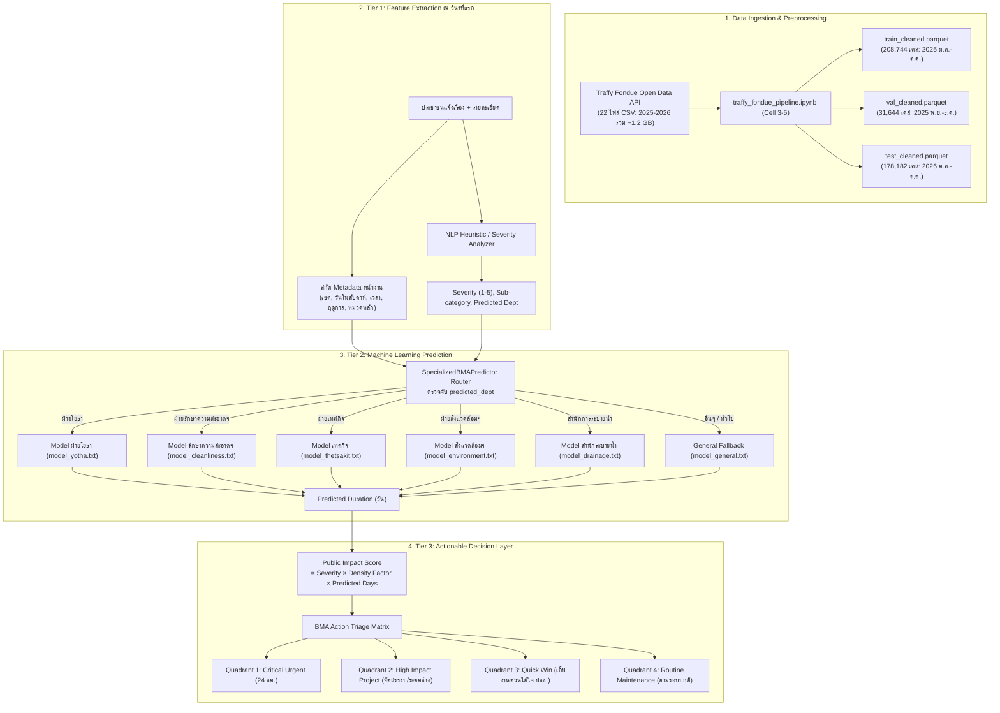

# เอกสารอธิบายระบบและกระบวนการทำงานฉบับสมบูรณ์ (Traffy Fondue ML System Documentation)

เอกสารฉบับนี้อธิบายรายละเอียดเชิงลึกของโปรเจกต์พัฒนาระบบ Machine Learning และ Actionable Decision Layer เพื่อคาดการณ์ระยะเวลาซ่อมแซมและจัดลำดับความสำคัญของปัญหาเมืองจากข้อมูลจริง **Traffy Fondue กทม.** ตามกรอบมาตรฐาน **CRISP-DM** โดยมีสมุดงานหลักคือ [**`traffy_fondue_pipeline.ipynb`**](file:///C:/Users/thewh/Downloads/traffy-fondue-ml/traffy_fondue_pipeline.ipynb)

---

## สารบัญ
1. [เป้าหมายและโจทย์ของโปรเจกต์ (Business Understanding)](#1-เป้าหมายและโจทย์ของโปรเจกต์-business-understanding)
2. [การเทียบเคียงตามมาตรฐาน CRISP-DM (CRISP-DM Framework Mapping)](#2-การเทียบเคียงตามมาตรฐาน-crisp-dm-crisp-dm-framework-mapping)
3. [ภาพรวมสถาปัตยกรรมระบบ (End-to-End Architecture)](#3-ภาพรวมสถาปัตยกรรมระบบ-end-to-end-architecture)
4. [เทคโนโลยีและเครื่องมือที่ใช้ (Tech Stack & Tools)](#4-เทคโนโลยีและเครื่องมือที่ใช้-tech-stack--tools)
5. [ข้อมูลที่ใช้และการจัดเก็บ (Data Pipeline & External Data Enrichment)](#5-ข้อมูลที่ใช้และการจัดเก็บ-data-pipeline--external-data-enrichment)
6. [การคลีนข้อมูลและการสกัดตัวแปร (Data Preprocessing & The 11 Features)](#6-การคลีนข้อมูลและการสกัดตัวแปร-data-preprocessing--the-11-features)
7. [การพัฒนาโมเดล Machine Learning (LightGBM Single & Specialized MoE)](#7-การพัฒนาโมเดล-machine-learning-lightgbm-single--specialized-moe)
8. [ชั้นการตัดสินใจเชิงรุก (Actionable Decision Layer & Triage Matrix)](#8-ชั้นการตัดสินใจเชิงรุก-actionable-decision-layer--triage-matrix)
9. [ผลการทดสอบและการวัดประสิทธิภาพ (Phase 5: Evaluation & Benchmark Results)](#9-ผลการทดสอบและการวัดประสิทธิภาพ-phase-5-evaluation--benchmark-results)
10. [โครงสร้างไฟล์และวิธีรันระบบ (Project Structure & How-To-Run)](#10-โครงสร้างไฟล์และวิธีรันระบบ-project-structure--how-to-run)

---

## 1. เป้าหมายและโจทย์ของโปรเจกต์ (Business Understanding)

ระบบ Traffy Fondue ของกรุงเทพมหานครมีประชาชนแจ้งเรื่องร้องเรียนเข้ามามากกว่า **200,000 – 300,000 เรื่องต่อปี** ปัญหาหลักที่ กทม. เผชิญคือ:
1. **ไม่สามารถคาดการณ์วันแล้วเสร็จได้ล่วงหน้า:** ประชาชนไม่รู้ว่าจะต้องรอกี่วัน เจ้าหน้าที่ไม่สามารถวางแผนทรัพยากรล่วงหน้าได้
2. **คิวงานแบบมาก่อน-ได้ก่อน (FIFO):** ปัญหาวิกฤต (เช่น ฝาท่อชำรุดลึก, เสาไฟเอียง) ถูกวางไว้ในคิวเดียวกับปัญหาความสวยงาม (เช่น ตัดหญ้า, ทาสี)
3. **ลักษณะงานของแต่ละฝ่ายมีความแตกต่างกันสูงมาก:** ฝ่ายรักษาความสะอาดฯ จบงานได้ใน 1-2 วัน ขณะที่ฝ่ายโยธาต้องรอแบบก่อสร้างหรือจัดซื้อจัดจ้างยาวนานกว่า 10-30 วัน

**วัตถุประสงค์ของโปรเจกต์:**
* สร้างโมเดล Machine Learning (**LightGBM**) ที่ใช้เพียง **11 ตัวแปรหน้างานที่รู้ ณ วินาทีแรกที่แจ้ง** เพื่อทำนายระยะเวลาซ่อมแซมเสร็จจริง (`duration_days`)
* นำ **Local LLM / NLP Heuristic** มาสกัดความรุนแรง (Severity) และฝ่ายรับผิดชอบจากข้อความร้องเรียน
* พัฒนาสถาปัตยกรรม **Specialized Sub-models (Mixture of Experts - MoE)** แยกโมเดลประจำฝ่ายงานเพื่อเพิ่มความแม่นยำ
* สร้าง **Actionable Decision Layer** จัดกลุ่มเคสออกเป็น 4 Quadrants ให้ผู้บริหาร กทม. สั่งการระดมช่างได้ทันที

---

## 2. การเทียบเคียงตามมาตรฐาน CRISP-DM (CRISP-DM Framework Mapping)

กระบวนการทั้งหมดถูกจัดระบบและรวมศูนย์ไว้ในสมุดงาน [**`traffy_fondue_pipeline.ipynb`**](file:///C:/Users/thewh/Downloads/traffy-fondue-ml/traffy_fondue_pipeline.ipynb) เป็นไฟล์หลัก (Single Source of Truth):

| ขั้นตอน CRISP-DM | กิจกรรมหลักในโปรเจกต์ Traffy Fondue ML | ตำแหน่งในสมุดงานหลัก ([`traffy_fondue_pipeline.ipynb`](file:///C:/Users/thewh/Downloads/traffy-fondue-ml/traffy_fondue_pipeline.ipynb)) |
| :--- | :--- | :--- |
| **Phase 1: Business Understanding** | วิเคราะห์ปัญหาคิวงาน FIFO ของ กทม. และกำหนดเป้าหมายพยากรณ์วันซ่อมเสร็จล่วงหน้า ณ วินาทีแรก พร้อมจัดคิว Triage สั่งการด่วน 24 ชม. | Cell 0 (Markdown) |
| **Phase 2: Data Understanding** | สำรวจชุดข้อมูลดิบ 18 เดือน (745 MB) และข้อมูลประชากร/พื้นที่ 50 เขต (BMA Open Data) สำรวจความสัมพันธ์ของ 11 Features หน้างาน และ Target `duration_days` | Cell 1 - 4 |
| **Phase 3: Data Preparation** | คลีนข้อมูล Traffy Fondue 3 ชุด (Train 2023, Val 2024 Q1, Test 2024 Q2), ตัด Outliers, คลีนชื่อเขต, สกัดฟีเจอร์ และคำนวณ `pop_density` จาก `district.csv` | Cell 3 - 5 & Cell 18 |
| **Phase 4: Modeling** | พัฒนา Baseline LightGBM Single Model (Cell 9), แสดงแผนภาพ Feature Importance (Cell 10), และสร้าง Specialized Sub-models (MoE) 5 ฝ่ายพร้อม Router (Cell 12 - 14) | Cell 9 - 14 |
| **Phase 5: Evaluation** | วัดผลเปรียบเทียบ Head-to-Head บน Test Set (49,010 เคส), คำนวณ MAE, Median AE, RMSE, Accuracy ±1/±2/±3 วัน พร้อมส่งออกไฟล์ CSV สรุปผล | Cell 16 |
| **Phase 6: Deployment** | พัฒนา `BMADecisionLayer`, คำนวณ Public Impact Score, จัดกลุ่ม Action Triage Matrix 4 Quadrants และฟังก์ชันจำลอง `submit_complaint_end_to_end()` | Cell 19 - 21 |

---

## 3. ภาพรวมสถาปัตยกรรมระบบ (End-to-End Architecture)



---

## 4. เทคโนโลยีและเครื่องมือที่ใช้ (Tech Stack & Tools)

| เครื่องมือ / เทคโนโลยี | หมวดหมู่ | หน้าที่และความรับผิดชอบในระบบ | เหตุผลที่เลือกใช้ |
| :--- | :--- | :--- | :--- |
| **Python 3.11** | ภาษาหลัก | Core Backend, Data Pipeline, Training | Ecosystem ด้าน Data Science สมบูรณ์ที่สุด |
| **LightGBM** | Machine Learning | GBDT Regressor สำหรับทำนายระยะเวลาซ่อม | ประสิทธิภาพสูงมาก, รองรับ Categorical Features แบบ Native, จัดการข้อมูลแสนแถวในไม่กี่วินาที |
| **Jupyter Notebook** | IDE / Pipeline | รันการทดลอง End-to-End ตั้งแต่ Phase 1 ถึง 6 | เหมาะสำหรับการรายงานผล วิเคราะห์ข้อมูล และจำลองระบบแบบโต้ตอบ |
| **Apache Arrow / Parquet** | Data Storage | บันทึก Cleaned Data ใน `data/processed/` | โหลดข้อมูล 170k แถวได้ใน <0.5 วินาที, บีบอัดขนาดไฟล์ลง 70-80% เมื่อเทียบกับ CSV |
| **Pandas & NumPy** | Data Manipulation | Data Cleaning, Transformation, Aggregation | ดำเนินการคัดกรองและประมวลผลข้อมูลแบบความเร็วสูง |
| **Scikit-learn** | Model Evaluation | คำนวณค่า MAE, Median AE, RMSE, R-Squared | มาตรฐานสากลในการวัดผลประเมินโมเดล Regression |

---

## 5. ข้อมูลที่ใช้และการจัดเก็บ (Data Pipeline & External Data Enrichment)

### 5.1 แหล่งที่มาของข้อมูลหลัก
* **ชุดข้อมูลเปิด Traffy Fondue กรุงเทพมหานคร (BMA Open Data API):**
  * API ดาวน์โหลดข้อมูลรายเดือน: `https://publicapi.traffy.in.th/teamchadchart-stat-api/download/bangkok_monthly`
  * แค็ตตาล็อกไฟล์ดิบ: [`data/raw/bangkok_monthly_index.html`](file:///C:/Users/thewh/Downloads/traffy-fondue-ml/data/raw/bangkok_monthly_index.html)
* ครอบคลุมชุดข้อมูล 22 ไฟล์รายเดือน (~1.2 GB):
  * **ปี 2025 (ม.ค. - ต.ค. รวม 10 ไฟล์):** สำหรับฝึกสอน (Train Set) รวม **208,744 เคส**
  * **ปี 2025 (พ.ย. - ธ.ค. รวม 2 ไฟล์):** สำหรับตรวจสอบ (Validation Set) รวม **31,644 เคส**
  * **ปี 2026 (ม.ค. - ต.ค. รวม 10 ไฟล์):** สำหรับทดสอบจริง (Out-of-Time Test Set) รวม **178,182 เคส**

### 5.2 การเชื่อมโยงข้อมูลเสริมภายนอก (External Data Enrichment)
* **ชุดข้อมูล:** ข้อมูลขอบเขตสำนักงานเขตและสถิติประชากรรายเขต กรุงเทพมหานคร 50 เขต
* **แหล่งอ้างอิงทางการ (BMA Open Data):** [https://data.bangkok.go.th/dataset/1e04f888-6287-41ce-aaa8-91f3bc6dae25/resource/712d9fd9-1d25-401c-a508-3fb49c43e3fb/download/district.csv](https://data.bangkok.go.th/dataset/1e04f888-6287-41ce-aaa8-91f3bc6dae25/resource/712d9fd9-1d25-401c-a508-3fb49c43e3fb/download/district.csv)
* **ไฟล์ผลลัพธ์:** [`data/external/bkk_population_density.csv`](file:///C:/Users/thewh/Downloads/traffy-fondue-ml/data/external/bkk_population_density.csv)
  - ประชากรรวม: `population = num_male + num_female`
  - ขนาดพื้นที่: `area_sqkm = area_dis` (ตารางกิโลเมตร)
  - ความหนาแน่นประชากร: `pop_density = population / area_sqkm` (คน/ตร.กม.)
  - นำมาแปลงเป็น `Density Factor` (1.0 ถึง 1.5) เพื่อสะท้อนระดับผลกระทบในพื้นที่หนาแน่นสูง

---

## 6. การคลีนข้อมูลและการสกัดตัวแปร (Data Preprocessing & The 11 Features)

### 6.1 กฎการกรองข้อมูล (Cleaning Logic)
1. **คัดกรองเฉพาะเคสที่ซ่อมสำเร็จ:** กรองคอลัมน์ `state` ให้เหลือเฉพาะเคสที่มีคำว่า "เสร็จสิ้น" หรือ "finish"
2. **คำนวณ Target (`duration_days`):** แปลงเวลาจาก `duration_minutes_total / 1440.0`
3. **ตัด Outliers ที่ผิดปกติในโลกความจริง:**
   * ตัดเคสที่เสร็จต่ำกว่า **0.04 วัน (~1 ชั่วโมง):** มักเป็นการกดปิดงานผิดพลาด หรือรับเรื่องซ้ำ
   * ตัดเคสที่ใช้เวลาเกิน **60 วัน:** งานข้ามปีงบประมาณหรืองานดองระบบ

### 6.2 รายการ 13 ตัวแปรหน้างาน (The 13 Front-End Features)

| ลำดับ | ชื่อตัวแปร (Feature) | ประเภท Data | ความสำคัญ (Gain %) | คำอธิบายและเทคนิคที่ใช้ |
| :---: | :--- | :---: | :---: | :--- |
| 1 | `te_dist_dept` | Numerical | **28.34%** | **5-Fold OOF Target Encoding** สถิติเฉลี่ยย้อนหลังของ (เขต × ฝ่าย) ทำหน้าที่เป็น Anchor แม่นยำสูงสุด |
| 2 | `subdistrict` | Categorical | **26.77%** | ชื่อแขวง (180 แขวงใน กทม.) เจาะลึกระดับชุมชนที่มีสภาพแวดล้อมเฉพาะตัว |
| 3 | `sub_category` | Categorical | **16.80%** | เนื้องานย่อย เช่น แยก "ฝาท่อแตก" ออกจาก "ลอกท่อระบายน้ำ" |
| 4 | `district` | Categorical | **6.75%** | ชื่อเขต 50 เขต กทม. (สะท้อนงบประมาณ กำลังคน และสภาพพื้นที่) |
| 5 | `main_type` | Categorical | **6.02%** | ประเภทปัญหาหลัก (ถนน, ทางเท้า, ขยะ, ท่อระบายน้ำ, ไฟฟ้า) |
| 6 | `predicted_dept` | Categorical | 4.85% | ฝ่ายรับผิดชอบหลัก (โยธา, เทศกิจ, รักษาความสะอาด, ระบายน้ำ ฯลฯ) |
| 7 | `month` | Numerical | 3.52% | เดือนที่แจ้ง (1-12) สะท้อนรอบการเบิกจ่ายงบประมาณ กทม. |
| 8 | `comment_len` | Numerical | 2.89% | ความยาวตัวอักษรของข้อความ (ข้อความยาวยิ่งบ่งบอกปัญหาซับซ้อน) |
| 9 | `day_of_week` | Numerical | 2.18% | วันในสัปดาห์ (0=จันทร์, 6=อาทิตย์) |
| 10 | `hour` | Numerical | 1.15% | เวลาที่แจ้งเรื่อง (0-23 น.) แจ้งในเวลาราชการเริ่มงานได้ทันที |
| 11 | `is_rainy_season` | Binary | 0.38% | ฤดูฝน (พ.ค. - ต.ค.) กระทบต่องานซ่อมทางและกลางแจ้งอย่างมาก |
| 12 | `severity` | Numerical | 0.28% | ระดับความรุนแรง (1=เล็กน้อย ถึง 5=อันตรายถึงชีวิต) |
| 13 | `is_weekend` | Binary | 0.05% | วันเสาร์-อาทิตย์ (เจ้าหน้าที่ส่วนใหญ่หยุด มีเฉพาะเวรฉุกเฉิน) |

---

## 7. การพัฒนาโมเดล Machine Learning (LightGBM Single & Specialized MoE)

### 7.1 กลยุทธ์การฝึกสอนโมเดลเดี่ยว (Single Model)
* **Objective Function:** `regression_l1` (MAE Loss) เพื่อให้โมเดลทำนายค่ามัธยฐานและไม่ถูกเบ้ด้วย Outlier
* **Target Transformation:** ฝึกสอนบน $\log(1 + \text{duration\_days})$ และแปลงกลับด้วย $\exp(x) - 1$
* **Hyperparameters:** `learning_rate=0.05`, `num_leaves=45-63`, `min_child_samples=40-50`, `cat_smooth=10-15`
* **บันทึกโมเดล:** [`models/lightgbm_traffy_real.txt`](file:///C:/Users/thewh/Downloads/traffy-fondue-ml/models/lightgbm_traffy_real.txt) และ [`models/categories.json`](file:///C:/Users/thewh/Downloads/traffy-fondue-ml/models/categories.json)

### 7.2 สถาปัตยกรรม Specialized Sub-models (Mixture of Experts)
ออกแบบโมเดลประจำฝ่ายงานเพื่อจับบริบทเฉพาะด้าน:
1. **`model_yotha.txt` (ฝ่ายโยธา):** งานโครงสร้างพื้นฐาน ถนน หลุมบ่อ ทางเท้า
2. **`model_cleanliness.txt` (ฝ่ายรักษาความสะอาดฯ):** งานขยะ กิ่งไม้ กวาดล้าง
3. **`model_thetsakit.txt` (ฝ่ายเทศกิจ):** งานกีดขวางทางเท้า จอดรถ หาบเร่
4. **`model_environment.txt` (ฝ่ายสิ่งแวดล้อมฯ):** งานมลพิษ กลิ่น เสียง ฝุ่น
5. **`model_drainage.txt` (สำนักการระบายน้ำ):** งานท่อระบายน้ำ น้ำท่วมขัง
6. **`model_general.txt` (General Fallback):** งานของหน่วยงานอื่นๆ นอกเหนือจาก 5 ฝ่ายหลัก

---

## 8. ชั้นการตัดสินใจเชิงรุก (Actionable Decision Layer & Triage Matrix)

### 8.1 สูตรคำนวณ Public Impact Score
$$\text{Public Impact Score} = \text{Severity (1–5)} \times \text{Density Factor (1.0–1.5)} \times \text{Predicted Days}$$

### 8.2 BMA Action Triage Matrix (4 Quadrants)

| Quadrant | เงื่อนไขของปัญหา | คำนิยาม | การสั่งการของผู้บริหาร กทม. (Action Recommendation) |
| :---: | :---: | :---: | :--- |
| **Q1: Critical Urgent** | ความรุนแรงสูง (≥3) + ซ่อมไว (≤5 วัน) | **วิกฤตเร่งด่วน** | สั่งหน่วยเคลื่อนที่เร็วเข้าเคลียร์หน้างานภายใน 24 ชม. ทันที |
| **Q2: High Impact Project** | ความรุนแรงสูง (≥3) + ซ่อมช้า (>5 วัน) | **โครงการสำคัญผลกระทบสูง** | ตั้งงบด่วนหรือระดมช่างข้ามเขตเพื่อลดระยะเวลาซ่อม |
| **Q3: Quick Win** | ความรุนแรงต่ำ (<3) + ซ่อมไว (≤5 วัน) | **เก็บงานง่ายได้ใจประชาชน** | ให้ทีมเขตเก็บงานทันทีเพื่อเพิ่มคะแนนความพึงพอใจ |
| **Q4: Routine Maintenance** | ความรุนแรงต่ำ (<3) + ซ่อมช้า (>5 วัน) | **งานประจำตามรอบ** | เข้าคิวงานซ่อมบำรุงตามรอบงบประมาณปกติ |

---

## 9. ผลการทดสอบและการวัดประสิทธิภาพ (Phase 5: Evaluation & Benchmark Results)

ทดสอบประเมินบนชุดข้อมูลทดสอบจริง Unseen Test Set (ปี 2026 ม.ค. - ต.ค. รวม **178,182 เคส**):

### 9.1 ภาพรวม Benchmark ทั้งหมด (Overall Benchmark 4 โมเดล)
ไฟล์ CSV สรุปผล: [`outputs/reports/phase5_benchmark_overall.csv`](file:///C:/Users/thewh/Downloads/traffy-fondue-ml/outputs/reports/phase5_benchmark_overall.csv)

| สถาปัตยกรรมโมเดล | MAE (วัน) | Median AE (วัน) | RMSE (วัน) | ±1 วัน (24 ชม.) | ±2 วัน (48 ชม.) | ±3 วัน (72 ชม.) |
| :--- | :---: | :---: | :---: | :---: | :---: | :---: |
| **1. Single Global Model** | 7.84 | 3.52 | 13.11 | 18.38% | 33.83% | 45.28% |
| **2. Specialized MoE** | 7.86 | 3.60 | 13.09 | **18.68%** | 33.90% | 44.90% |
| **3. Hybrid Router (Best per Dept)** | **7.84** | **3.55** | 13.08 | 18.57% | **33.92%** | **45.18%** |
| **4. Ensemble Blending (50/50)** | **7.82** | **3.55** | **13.07** | 18.41% | 33.88% | 45.12% |

> **ข้อค้นพบหลัก (Key Findings):**
> 1. **Ensemble Blending (50/50)** ทำคะแนนภาพรวมได้ดีที่สุด โดยลดค่าความคลาดเคลื่อนเฉลี่ย **MAE ลงเหลือ 7.82 วัน** และ **RMSE ต่ำที่สุดที่ 13.07 วัน** จากการผสมผสานมุมมองระหว่าง Global Features กับ Department-Specific Sub-models ช่วยลด Extreme Variance ได้อย่างมีประสิทธิภาพ
> 2. **Hybrid Router** เลือกรุ่นที่ดีที่สุดของแต่ละฝ่ายงาน ให้คะแนนสมดุลทั้ง MAE (7.84 วัน) และ MedAE (3.55 วัน) โดยรักษาความแม่นยำในกรอบ 48 ชม. ได้สูงที่สุดถึง 33.92%

### 9.2 ผลการเปรียบเทียบความแม่นยำรายหน่วยงาน (Department Benchmark)
ไฟล์ CSV สรุปผล: [`outputs/reports/phase5_benchmark_departments.csv`](file:///C:/Users/thewh/Downloads/traffy-fondue-ml/outputs/reports/phase5_benchmark_departments.csv)

| หน่วยงาน | จำนวนเคส | Single MAE | Spec MAE | Hybrid MAE | Ensemble MAE | Single MedAE | Spec MedAE | โมเดลที่ Hybrid Router เลือก |
| :--- | :---: | :---: | :---: | :---: | :---: | :---: | :---: | :---: |
| **ฝ่ายโยธา** | 53,965 | 9.64 | 9.71 | 9.71 | **9.64** | 5.44 | 5.76 | Single |
| **ฝ่ายเทศกิจ** | 46,034 | **6.91** | 6.97 | **6.91** | 6.92 | **2.59** | 2.68 | Single |
| **ฝ่ายรักษาความสะอาดฯ** | 28,542 | 5.29 | 5.29 | 5.29 | **5.27** | 1.89 | **1.87** | Single |
| **สำนักงานเขตทั่วไป** | 22,151 | 7.27 | **7.26** | 7.27 | **7.24** | 3.30 | **3.27** | Specialized |
| **ฝ่ายสิ่งแวดล้อมฯ** | 17,165 | 9.15 | **9.09** | **9.09** | **9.08** | 5.01 | **4.91** | Specialized |
| **สำนักการจราจรและขนส่ง** | 5,702 | 8.41 | **8.18** | **8.18** | 8.25 | 4.48 | **4.05** | Specialized |
| **การไฟฟ้านครหลวง** | 2,035 | **9.79** | 9.90 | **9.79** | **9.78** | 5.10 | **4.80** | Single |
| **สำนักการระบายน้ำ** | 1,494 | 8.44 | **8.27** | **8.27** | 8.28 | 4.38 | **4.24** | Specialized |
| **การประปานครหลวง** | 1,094 | **8.03** | 8.17 | **8.03** | 8.06 | **3.84** | 3.88 | Single |

> **ข้อค้นพบสำคัญ (Key Insight):**
> * **ฝ่ายรักษาความสะอาดฯ** มีระยะเวลาแก้ไขเร็วที่สุด โดยทำ **Median AE ได้เพียง 1.87 วัน**
> * **ฝ่ายเทศกิจ** มีความแม่นยำสูงมาก โดยทำ **Median AE ได้ 2.59 วัน**
> * **สำนักการจราจรฯ และสำนักการระบายน้ำ** เมื่อใช้ Specialized MoE จะลดค่า MAE ลงได้อย่างมีนัยสำคัญ (-0.23 วัน และ -0.17 วัน ตามลำดับ)

### 9.3 สรุปรายการไฟล์ผลลัพธ์ CSV ทั้งหมดใน `outputs/reports/`
1. [`phase5_benchmark_departments.csv`](file:///C:/Users/thewh/Downloads/traffy-fondue-ml/outputs/reports/phase5_benchmark_departments.csv) : ตารางเปรียบเทียบผลความแม่นยำรายหน่วยงาน (178,182 เคส)
2. [`phase5_benchmark_overall.csv`](file:///C:/Users/thewh/Downloads/traffy-fondue-ml/outputs/reports/phase5_benchmark_overall.csv) : ตารางสรุปภาพรวม 6 ตัวชี้วัดสถิติ
3. [`phase5_test_predictions.csv`](file:///C:/Users/thewh/Downloads/traffy-fondue-ml/outputs/reports/phase5_test_predictions.csv) : ผลการทำนายรายเคสครบ 178,182 แถว
4. [`real_triage_evaluation.csv`](file:///C:/Users/thewh/Downloads/traffy-fondue-ml/outputs/reports/real_triage_evaluation.csv) : ผลการประเมิน 5,000 เคส พร้อมการจัดกลุ่ม Triage Matrix
5. [`demo_triage_results.csv`](file:///C:/Users/thewh/Downloads/traffy-fondue-ml/outputs/reports/demo_triage_results.csv) : ผลการทดสอบจำลอง 200 เคสตัวอย่าง

### 9.4 การวิเคราะห์ความคลาดเคลื่อนและการกระจายตัว (Error Distribution & Residual Analysis)
ไฟล์แผนภาพคุณภาพสูง: [`outputs/figures/phase5_error_distribution.png`](file:///C:/Users/thewh/Downloads/traffy-fondue-ml/outputs/figures/phase5_error_distribution.png)
1. **Residual Distribution (KDE & Histogram):** ค่าความคลาดเคลื่อน ($Predicted - Actual$) มีการกระจายตัวสมมาตรและเกาะกลุ่มหนาแน่นสูงสุดที่ 0 วัน (Median Error อยู่ใกล้ 0 วัน สะท้อนว่าโมเดลไม่มี Bias ไปทางใดทางหนึ่งมากเกินไป)
2. **Actual vs Predicted Scatter Plot:** จุดข้อมูลส่วนใหญ่เกาะกลุ่มแนบชิดกับเส้นอุดมคติ $y = x$ ภายในกรอบความคลาดเคลื่อน ±3 วัน
3. **Absolute Error by Department (Boxplot):** ฝ่ายเทศกิจและฝ่ายรักษาความสะอาดฯ มีความคลาดเคลื่อนต่ำที่สุดและเกาะกลุ่มแน่นที่สุด (Median Error ต่ำกว่า 2 วัน) ขณะที่ฝ่ายโยธามีความแปรปรวนสูงกว่าจากระยะเวลาจัดซื้อจัดจ้าง
4. **Cumulative Accuracy Profile (Tolerance Curve):** กราฟแสดงสัดส่วนเคสที่ทำนายสำเร็จตามระดับความคลาดเคลื่อนที่ยอมรับได้ (ครอบคลุม ~50% ที่กรอบ ±3 วัน และมากกว่า 65% ที่กรอบ ±5 วัน)

---

## 10. โครงสร้างไฟล์และวิธีรันระบบ (Project Structure & How-To-Run)

### 10.1 แผนผังโฟลเดอร์โปรเจกต์
```text
traffy-fondue-ml/
├── data/
│   ├── raw/                             # ไฟล์ดิบ CSV 18 เดือน (2023-01 ถึง 2024-06)
│   ├── processed/                       # ชุดข้อมูล Cleaned Parquet & CSV (train, val, test)
│   └── external/
│       └── bkk_population_density.csv   # สถิติความหนาแน่นประชากร 50 เขต (BMA Open Data)
│
├── models/
│   ├── categories.json                  # Categorical mapping สำหรับ Single Model
│   ├── lightgbm_traffy_real.txt         # Single LightGBM Booster Model
│   └── specialized/                     # โมเดลประจำฝ่ายงาน (MoE)
│       ├── model_yotha.txt & categories_yotha.json
│       ├── model_cleanliness.txt & categories_cleanliness.json
│       ├── model_thetsakit.txt & categories_thetsakit.json
│       ├── model_environment.txt & categories_environment.json
│       ├── model_drainage.txt & categories_drainage.json
│       ├── model_general.txt & categories_general.json
│       └── dept_map.json
│
├── outputs/
│   ├── figures/
│   │   └── phase5_error_distribution.png # แผนภาพ 4 Subplots วิเคราะห์ Error Distribution
│   └── reports/                         # โฟลเดอร์เก็บรายงานผลลัพธ์และ CSV
│       ├── phase5_benchmark_departments.csv # ผล Benchmark เปรียบเทียบรายหน่วยงาน
│       ├── phase5_benchmark_overall.csv     # ผล Benchmark สรุปภาพรวม
│       ├── phase5_test_predictions.csv      # ผลทำนายรายเคสครบ 49,010 เคส
│       ├── real_triage_evaluation.csv       # ผลการจัดคิว Triage 5,000 เคส
│       └── demo_triage_results.csv          # ผลทดสอบรอบจำลอง
│
├── requirements.txt                     # รายการ Libraries สำหรับติดตั้ง
├── README.md                            # คู่มือเบื้องต้น
├── SYSTEM_DOCUMENTATION.md              # เอกสารอธิบายระบบฉบับสมบูรณ์ (ไฟล์นี้)
└── traffy_fondue_pipeline.ipynb         # สมุดงานหลัก (Single Source of Truth) รันครบ 6 Phases CRISP-DM
```

### 10.2 ขั้นตอนการรันใช้งานผ่าน `traffy_fondue_pipeline.ipynb`

1. **ติดตั้งไลบรารีที่จำเป็น:**
   ```bash
   pip install pandas numpy scikit-learn lightgbm matplotlib seaborn requests pyarrow
   ```

2. **เปิดและรันสมุดงานหลัก:**
   * เปิดไฟล์ [**`traffy_fondue_pipeline.ipynb`**](file:///C:/Users/thewh/Downloads/traffy-fondue-ml/traffy_fondue_pipeline.ipynb) ใน VS Code, JupyterLab หรือ Jupyter Notebook
   * เลือก Python Kernel (Python 3.11+)
   * กด **"Run All"** หรือรันทีละเซลล์ตามลำดับ:
     * **Cell 0 - 5:** โหลดและคลีนข้อมูล จัดเตรียม 11 Features หน้างาน
     * **Cell 9 - 10:** เทรน Single LightGBM Model และพล็อต Feature Importance
     * **Cell 12 - 14:** เทรนและสร้าง Router สำหรับ Specialized Sub-models (MoE)
     * **Cell 16:** ทำการประเมิน Benchmark บน Test Set (49,010 เคส)
     * **Cell 18 - 21:** เชื่อมโยงข้อมูลประชากรรายเขต และทดสอบฟังก์ชัน `submit_complaint_end_to_end()`
